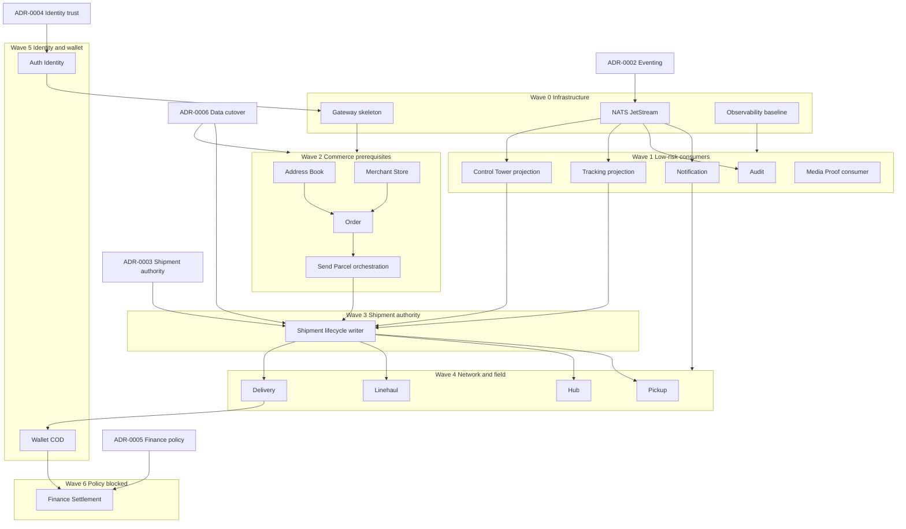

# ADR-0001: Transitional Deployables and Extraction Order

- **Status:** Accepted
- **Date:** 2026-08-30
- **Deciders:** platform architecture review (Wave 1 integration)

Statement classes used throughout: **evidence**, **proposal**, **decision**, **assumption**,
**unresolved policy**. A suggested deployable count is **not** an architectural fact.

## Context

### Problem statement

The HUDHUD platform must extract bounded contexts from the legacy modular monolith
(`hudhud-backend`) into independently deployable FastAPI services while preserving
canonical ownership, migration safety, and operability on current infrastructure.
**Evidence:** platform README states Foundation F0 — no services scaffolded yet
(`README.md`); legacy audit inventories under `docs/audit/`.

The decision question is **not** “how many services exist forever?” but:

1. Which **target bounded contexts** remain distinct regardless of runtime packaging?
2. Which **transitional deployables** (temporary runtime groupings) are credible on a
   16 GB host before full extraction?
3. In what **order** should contexts be extracted, starting with low-risk consumers?

### Verified platform constraints (evidence)

| Constraint | Source |
|------------|--------|
| Monorepo is a development boundary, not runtime | `architecture/invariants.md`, `AGENTS.md` |
| Shipment is sole canonical lifecycle writer | `architecture/invariants.md`, `ownership-matrix.yaml` |
| Hub and Linehaul are separate bounded contexts | `architecture/service-boundaries.yaml` (`hub`, `linehaul` entries) |
| Finance is policy-blocked | `service-boundaries.yaml` → `finance_settlement.transitional_deployable_candidate: policy_blocked` |
| One-writer cutover; no bidirectional dual-write | `architecture/invariants.md` |
| Docker Compose orchestrator; Blue/Green per changed service | `architecture/invariants.md`, `infra/README.md` |
| 16 GB host — deployment isolation, not HA | `infra/README.md`, `docs/audit/legacy-runtime-inventory.md` |
| NATS JetStream target; legacy has none | `architecture/invariants.md`, `legacy-runtime-inventory.md` |
| No services or compose scaffold yet (F0) | `services/README.md`, `infra/README.md` |

### Verified legacy baseline (evidence)

| Item | Evidence |
|------|----------|
| Repository | `/Users/mohammadakbari/Development/Projects/Python/hudhud-backend` |
| HEAD SHA | `2e375057fdf9b9ce8416408a4436303be5301def` |
| Pattern | Clean modular monolith — single `app/main.py` registers 46+ routers |
| Modules | 22 under `app/modules/` (see `docs/audit/legacy-baseline.md`) |
| Database | Single PostgreSQL 16, 78 Alembic revisions, head `b8c9d0e1f2a3` |
| Production stack | app + Postgres + Redis + MinIO; optional script workers |
| Inter-module comms | In-process calls; `push_outbox` table for notification only |
| Shipment status writers | pickup, hub, linehaul, delivery_task, shipment (multi-writer violation) |
| Finance module | Missing — deferred in legacy docs |

Key legacy file references:

- Composition root: `app/main.py` (46+ router imports)
- Shipment status enum: `app/modules/shipment/domain/enums.py` → `ShipmentStatus`
- Pickup mutates shipment: `app/modules/pickup/application/acceptance_scan_pickup_task.py`
  (lines ~272–275 set `shipment.current_status = ShipmentStatus.IN_CUSTODY`)
- Hub mutates shipment: `app/modules/hub/application/origin_hub_inbound_scan.py`
- Linehaul mutates shipment: `linehaul/application/dispatch_linehaul_trip.py`,
  `arrive_linehaul_trip.py`
- Delivery + wallet orchestration: `delivery_task/application/complete_delivery_task.py`
- Tracking read projection: `app/modules/tracking/api/routes.py` (no dedicated tables)
- Notification outbox: `notification/infrastructure/models.py`, `scripts/run_push_outbox_worker.py`
- Finance deferral: `wallet/application/credit_cod_collection.py` — “Does not settle, pay out,
  or reconcile” (`docs/audit/legacy-domain-inventory.md`)

### Target bounded contexts (architectural semantics — not deployable count)

These contexts retain distinct ownership in `architecture/service-boundaries.yaml` regardless
of transitional runtime packaging:

| ID | Display name | Legacy classification | Platform writer (manifest) |
|----|--------------|-------------------------|----------------------------|
| `auth_identity` | Auth and Identity | verified | undecided |
| `customer` | Customer | partial (no module) | undecided |
| `address_book` | Address Book | verified | address_book |
| `merchant_store` | Merchant and Store | verified | merchant_store |
| `serviceability` | Serviceability | partial (send_parcel) | serviceability |
| `pricing_quote` | Pricing and Quote | partial (send_parcel) | pricing_quote |
| `order` | Order | verified | order |
| `send_parcel` | Send Parcel (orchestration) | verified | send_parcel |
| `shipment` | Shipment | verified | **shipment** (sole lifecycle writer) |
| `pickup` | Pickup | verified | pickup |
| `hub` | Hub | verified | hub |
| `linehaul` | Linehaul | verified | linehaul |
| `delivery` | Delivery | verified | delivery |
| `tracking` | Tracking | verified (read projection) | none (projection) |
| `control_tower` | Control Tower | partial (read aggregation) | none (projection) |
| `wallet_cod` | Wallet and COD | partial | wallet_cod |
| `finance_settlement` | Finance and Settlement | **policy-blocked** | finance (blocked) |
| `notification` | Notification | verified | notification |
| `support_claims` | Support and Claims | verified | support_claims |
| `media_proof` | Media and Proof | partial | undecided |
| `audit` | Audit | verified | audit |
| `gateway` | Gateway | new platform component | gateway |

**Proposal:** `send_parcel` is a commerce orchestration surface, not a substitute for Order or
Shipment ownership. It must not become a permanent “god service.”

### Bounded context versus deployable distinction

| Concept | Definition | Changes when? |
|---------|------------|---------------|
| **Bounded context** | Canonical semantic owner of domain language, mutable state, API, and events | Only by accepted ADR + manifest update |
| **Deployable (runtime)** | Independent Docker image, process, credentials, migrations, outbox/inbox | Operational choice; may group multiple contexts temporarily |
| **Transitional deployable** | Runtime grouping explicitly marked temporary with exit criteria | Dissolved when each inner context owns its runtime |

**Evidence:** `architecture/service-boundaries.yaml` header — “Deployable count is NOT fixed
here.” **Decision (binding invariant):** temporary grouping must not erase ownership or create
a new permanent monolith (`architecture/invariants.md`, `AGENTS.md`).

## Decision drivers

Ranked by dominance for this ADR:

1. **Canonical ownership preservation** — Shipment sole writer; Hub ≠ Linehaul; Finance
   policy-blocked (`architecture/invariants.md`, `ownership-matrix.yaml`).
2. **Migration risk** — Legacy multi-writer shipment graph and cross-module FKs
   (`docs/audit/legacy-data-ownership-inventory.md`); one-writer cutover mandatory.
3. **Infrastructure capacity** — Single 16 GB host; Compose orchestrator; no HA
   (`infra/README.md`).
4. **Database connection budget** — Each deployable typically holds its own pool; N deployables
   × pool size must fit Postgres `max_connections` on one host (**assumption:** default ~100
   connections unless tuned; exact prod value **unresolved policy**).
5. **Operational/on-call cost** — **Assumption:** small team; more deployables increase
   paging surface, deploy coordination, and backup scope (**team size unresolved policy**).
6. **Security and failure isolation** — Physical delivery irreversible; finance must not roll
   back delivery (`architecture/invariants.md`).
7. **Extraction sequencing** — Low-risk read/event consumers before authoritative write
   owners reduces blast radius.
8. **Deployment frequency** — Independent deploy per changed service is a platform goal
   (`architecture/invariants.md`); must be weighed against host RAM/CPU for concurrent images.

## Options

### Option A — Keep legacy modular monolith as permanent target

| Summary | Trade-offs |
|---------|------------|
| Continue evolving `hudhud-backend` as the runtime; platform repo remains governance-only or is abandoned for runtime. | **Pros:** Zero extraction risk; single DB pool; one deploy; matches current prod. **Cons:** Violates platform invariants (independent services, per-service credentials, NATS, no cross-module status mutation policy); no failure isolation; contradicts `hudhud_platform_backend` purpose (`README.md`). **Verdict:** Rejected as platform target — acceptable only as read-only reference during transition. |

### Option B — One deployable per bounded context immediately (~20+ runtimes)

| Summary | Trade-offs |
|---------|------------|
| Bootstrap all contexts as separate services from F1 onward. | **Pros:** Maximum isolation; clearest ownership mapping; aligns with manifest IDs. **Cons:** On 16 GB host, ~20+ Postgres instances or schemas + ~20+ app processes likely exceed RAM and connection budget; NATS + observability not scaffolded (`infra/README.md` F0); highest migration coordination (78 legacy migrations split); **assumption:** unsupportable for current team/on-call. **Verdict:** Rejected for initial plateau; remains **long-term direction** per context. |

### Option C — Staged transitional deployables preserving target boundaries (recommended proposal)

| Summary | Trade-offs |
|---------|------------|
| Group contexts into a small number of **named transitional runtimes** (3–5 **proposal**, not fact) with **internal package boundaries** and **explicit exit criteria**. Target contexts remain in manifest; grouping is operational only. | **Pros:** Fits 16 GB host; reduces connection pools and image count; allows incremental cutover; preserves Hub ≠ Linehaul semantics inside a grouped runtime. **Cons:** Risk of “mini-monolith” drift without exit enforcement; requires strict internal import rules and separate Alembic namespaces per context even when co-deployed. **Verdict:** **Proposed recommendation** for initial extraction waves. |

### Option D — Extract low-risk event consumers before authoritative write owners

| Summary | Trade-offs |
|---------|------------|
| First wave: Audit, Notification, Tracking/Control Tower projections, Media/Proof consumers. Defer Shipment, Pickup, Hub, Linehaul, Delivery, Finance until messaging and identity exist. | **Pros:** Smallest write-ownership conflict; exercises NATS/outbox/inbox; read projections need not block on shipment DB cutover if fed by events (**proposal**). **Cons:** Projections still need event contracts (ADR-0002); Notification currently triggered in-process from shipment lifecycle in legacy. **Verdict:** **Proposed** as Wave 1 sequencing within Option C. |

## Comparative decision matrix

Scores: **Low** / **Med** / **High** impact or cost (qualitative — **proposal**, not measured).

| Criterion | A: Legacy monolith | B: Immediate full split | C: Transitional deployables | D: Consumers first (within C) |
|-----------|-------------------|-------------------------|----------------------------|--------------------------------|
| Domain ownership clarity | Med (legacy violations) | High | High (if exit criteria enforced) | High |
| Data ownership / one-writer | Low (multi-writer today) | High (once cut over) | Med→High (staged) | Med (writers deferred) |
| Team size / ownership fit | High (**assumption**) | Low | Med | Med |
| Change frequency tolerance | High (single deploy) | Med (many pipelines) | Med | Med |
| Runtime load on 16 GB host | High | Low | Med | Med |
| Security isolation | Low | High | Med | Med (consumers low risk) |
| Failure isolation | Low | High | Med | Med |
| Deployment frequency | Low (single blast radius) | High | Med | Med |
| Migration risk | None (stay) | High | Med | Low→Med |
| Operational / on-call cost | Low | High | Med | Med |
| DB connection budget | High (one pool) | Low | Med | Med |
| Rollback / recovery complexity | Low | High | Med | Low for Wave 1 |

## Proposed transitional plateau options

These are **proposals** for temporary runtime groupings. Each inner bounded context keeps its
manifest ID, ownership row, and (when extracted) dedicated credentials — co-location is not
co-ownership.

### Plateau P1 — Platform Edge (transitional)

| Inner contexts | Rationale | Exit criteria |
|----------------|-----------|---------------|
| `gateway` | Entry routing, auth termination | Gateway alone when all routes forwarded to extracted services |
| `notification` | Event-driven; legacy outbox pattern exists | Own DB + deploy when all lifecycle triggers are event-sourced |
| `audit` | Append-only; cross-cutting writers in legacy | Own deploy when all services emit audit via outbox/events |
| `tracking`, `control_tower` | Read projections; no legacy tables | Split when projection stores and SLAs require independent scale |

### Plateau P2 — Engagement and Proof (transitional)

| Inner contexts | Rationale | Exit criteria |
|----------------|-----------|---------------|
| `media_proof` | MinIO consumers; evidence spread across modules | Dedicated service when upload/policy ADR accepted |
| (optional) `support_claims` | Lower runtime load than operations | Extract when ticket volume or compliance isolation requires |

### Plateau P3 — Commerce (transitional — evaluated, not permanent)

| Inner contexts | Internal boundaries required | Exit criteria |
|----------------|------------------------------|---------------|
| `address_book`, `merchant_store`, `order`, `send_parcel`, `serviceability`, `pricing_quote`, `customer` (partial) | Separate packages; no shared ORM; distinct migration namespaces; Send Parcel orchestrates via HTTP/commands only | Each context owns DB + deploy when order/send-parcel traffic or merchant isolation warrants |
| **Must not** include Shipment lifecycle writes | Send Parcel publishes commands; Shipment service applies state | Send Parcel loses direct shipment table access after Shipment cutover |

### Plateau P4 — Network Operations (transitional)

| Inner contexts | Note | Exit criteria |
|----------------|------|---------------|
| `hub`, `linehaul` | **Distinct bounded contexts** — separate packages, event types, and DB schemas even if one runtime image | Separate deployables when trip/hub scaling or on-call rotation differs |
| **Must not** merge Hub and Linehaul ownership rows | Manifest IDs remain `hub` and `linehaul` | — |

### Plateau P5 — Field Operations (transitional)

| Inner contexts | Rationale | Exit criteria |
|----------------|-----------|---------------|
| `pickup`, `delivery` | High mobile/field coupling; legacy cross-calls | Split when driver apps/API SLAs differ or failure isolation required |
| Depends on Shipment authority (ADR-0003) | Legacy direct status mutation must end before cutover | Pickup/Delivery publish facts only |

### Plateau P6 — Core Authority (deferred — not first wave)

| Inner contexts | Why deferred |
|----------------|--------------|
| `shipment` | Central lifecycle authority; multi-writer legacy; highest reconciliation risk — **not chosen because “central” alone** |
| `auth_identity` | Identity/trust model unresolved (ADR-0004); gateway dependency |
| `wallet_cod`, `finance_settlement` | Finance **policy-blocked**; COD/wallet same-transaction as delivery in legacy |

**Proposal:** Target steady-state remains **one deployable per bounded context**; plateaus P1–P5
are capacity- and risk-driven shortcuts, not the architectural end state.

## Resource and capacity implications

| Resource | Evidence / assumption | Implication |
|----------|----------------------|-------------|
| Host RAM 16 GB | `infra/README.md` | **Proposal:** plan ≤5 concurrent app containers + Postgres + Redis + MinIO + NATS on prod host; full ~20-way split unlikely without second host |
| Postgres connections | **Assumption:** ~100 default max | **Proposal:** 5 transitional deployables × ~10 pool ≈ 50 app connections + admin/overhead; immediate 20 deployables likely exhaust budget |
| Docker images | Each service independent (`architecture/invariants.md`) | Transitional grouping reduces pull/storage; Blue/Green per service still applies to changed image |
| NATS JetStream | Not in legacy; F0 not scaffolded | Wave 0 infra prerequisite before consumer extraction |
| MinIO | Legacy verified | Media/Proof extraction shares object store; bucket policy per context |
| Backup/restore | Not documented in legacy | Each extracted DB adds backup scope (**operational gap — unresolved policy**) |

## Data ownership implications

| Phase | Write pattern | Notes |
|-------|---------------|-------|
| Legacy (today) | Single Postgres; multi-writer shipment | **Evidence:** `legacy-data-ownership-inventory.md` |
| Wave 1 consumers | Own tables where applicable; consume events | Audit, Notification — no shipment status writes |
| Wave 2+ commerce | One-writer per table cluster on cutover | Order, Address Book FKs become ID references across services |
| Shipment cutover | **Only** `shipment` writes `shipments.status` | Pickup/Hub/Linehaul/Delivery publish facts (**requires ADR-0003** authority and **ADR-0006** cutover protocol) |
| Delivery cutover | Irreversible physical delivery fact | Finance failure must not roll back (**invariant**) |
| Finance | Blocked until ADR-0005 | No double-entry ledger in legacy |

Cross-service FKs forbidden post-extraction (`architecture/invariants.md`). Legacy FK graph
(documented in audit) drives migration ordering: Merchant and Address Book before Order/Shipment
references.

## Extraction dependency graph



Text equivalent: Infrastructure (NATS, Gateway shell, observability) precedes all extraction.
Low-risk consumers depend on event contracts only. Commerce contexts precede Shipment
cutover because legacy Send Parcel creates Order + Shipment together. Shipment authority
precedes Pickup, Hub, Linehaul, and Delivery fact-only migration. Identity/Gateway full
cutover precedes field-scale traffic switching. Finance follows Wallet/Delivery fact
separation and ADR-0005.

**Policy gaps block only affected extraction work**, not the entire migration program.
Finance policy (ADR-0005) blocks Finance/Wallet settlement extraction only; Customer/Organization
policy (ADR-0004) blocks Customer bootstrap only.

## Proposed migration waves

| Wave | Contexts | Type | Primary risk | Prerequisites |
|------|----------|------|--------------|---------------|
| 0 | NATS, Gateway skeleton, observability | Infra | Greenfield ops | ADR-0002 (eventing topology) |
| 1 | Audit, Notification, Tracking, Control Tower, Media/Proof | Low-risk consumers / projections | Event contract gaps | Wave 0; shipment events may initially bridge from legacy |
| 2 | Address Book, Merchant, Order, Serviceability, Pricing, Send Parcel | Commerce transitional (P3) | FK severing; orchestration | ADR-0006 cutover patterns; partial Customer policy (ADR-0004) |
| 3 | Shipment | Authoritative writer | Multi-writer reconciliation | ADR-0003; ADR-0006; Wave 2 stable IDs |
| 4 | Pickup, Hub, Linehaul, Delivery | Field/network ops | Legacy status mutation removal | Wave 3; Hub ≠ Linehaul packages |
| 5 | Auth/Identity, Gateway traffic | Identity | Session/JWT trust boundary | ADR-0004 |
| 6 | Wallet/COD | Financial facts (not settlement) | Same-transaction legacy coupling | Delivery fact separation |
| 7 | Finance/Settlement | Policy-blocked | Accounting policy | ADR-0005; double-entry ADR |

**Explicit non-actions (proposal):**

- Do **not** extract Shipment in Wave 1 merely because it is central — wait until
  fact-only boundaries (ADR-0003) and cutover protocol (ADR-0006) are accepted.
- Do **not** extract Finance until policy ADRs resolve — manifest marks `policy_blocked`.
- Do **not** merge Hub and Linehaul ownership — grouping allowed only with exit criteria.

## Exit criteria (every temporary grouping)

| Transitional runtime | Exit when (all required) |
|---------------------|--------------------------|
| P1 Platform Edge | Each inner context has own Dockerfile, DB credentials, Alembic head, outbox/inbox, Compose profile, and on-call owner |
| P2 Engagement/Proof | Media/Proof ADR accepted; evidence uploads route to dedicated service API |
| P3 Commerce | Order and Send Parcel each pass one-writer cutover; Send Parcel no longer holds shipment ORM; merchant scaling or deploy frequency triggers Merchant split |
| P4 Network Ops (Hub+Linehaul) | Independent deploy, DB, and paging for Hub and Linehaul; no shared mutable schema |
| P5 Field Ops (Pickup+Delivery) | Pickup and Delivery each publish facts only; separate failure budgets validated |
| Any plateau | `transitional_deployable_candidate` in manifest updated from `pending_adr` to service name or dissolved; plateau documented as deprecated in a superseding ADR |

## Decision

**Status: Accepted.** The accepted decision is staged transitional deployables and
low-risk consumer-first extraction. The exact runtime count and grouping (3–5 initial
runtimes) remains **provisional and capacity/team dependent** — not an architectural fact.

**Accepted decision:**

Adopt **Option C + Option D**: staged transitional deployables (plateaus P1–P5) with
**Wave 0–7 sequencing**, preserving all target bounded contexts in
`architecture/service-boundaries.yaml`, extracting **low-risk consumers first**, deferring
**Shipment** until ADR-0003 and ADR-0006 are accepted, deferring **Finance** until ADR-0005
policy resolves, and enforcing **Hub ≠ Linehaul** semantic boundaries even if temporarily
co-deployed.

Suggested initial deployable count for first production plateau: **3–5 runtimes**
(**provisional default** — exact number requires capacity testing and team sign-off).

**Implementation gate:** Compose profiles, service bootstrap, and manifest
`transitional_deployable_candidate` field updates require capacity evidence and named
operational sign-off. Acceptance does not authorize immediate service implementation.

## Consequences

### Positive

- Aligns with platform invariants while acknowledging F0 and 16 GB constraints.
- Reduces Day-1 operational load versus immediate full split.
- Consumer-first waves validate NATS/outbox/inbox before lifecycle writer cutover.
- Commerce plateau respects legacy Send Parcel → Order + Shipment flow evidence.

### Negative

- Transitional runtimes risk entrenchment without enforced exit criteria.
- Co-deployed contexts may tempt cross-imports — architecture tests must extend to internal
  boundaries.
- Bridge period may require legacy event emission or dual-read projections (**technical debt**).

### Neutral

- Long-term target remains one deployable per bounded context.
- Manifest `transitional_deployable_candidate: pending_adr` fields stay until acceptance.

## Migration impact

- **Schema:** Per-context Alembic when extracted; legacy 78-revision chain split by ownership
  evidence in audits — exact split map deferred to ADR-0006 and per-context cutover plans.
- **Cutover:** One-writer per table cluster; credential revocation mandatory
  (`architecture/invariants.md`).
- **Compatibility:** Event bridges during transition must be idempotent; no bidirectional
  dual-write.
- **Shipment:** Legacy modules stop direct `shipments.status` updates when respective service
  cuts over — platform replacement is event publication (`ownership-matrix.yaml`).

## Observability

Required before Wave 1 production traffic (**proposal**):

| Signal | Requirement |
|--------|-------------|
| Logs | Structured JSON per deployable; request/service correlation |
| Traces | `traceparent` propagation HTTP → NATS → consumers (`architecture/invariants.md`) |
| Metrics | Outbox lag, inbox dedup rate, consumer lag, deploy health |
| Correlation | `correlation_id`, `causation_id` on all lifecycle events |
| Dashboards | Per-plateau SLOs; shipment lifecycle funnel after Wave 3 |

**Evidence gap:** Legacy lacks distributed tracing and Prometheus (`legacy-runtime-inventory.md`).

## Security

| Area | Impact |
|------|--------|
| Credentials | Per-service DB roles on cutover; no cross-service DB URLs (`AGENTS.md`) |
| Service identity | Explicit service credentials / mTLS — ADR-0004; no trust of `X-User-Id` headers |
| Gateway | Must not orchestrate business logic (`architecture/invariants.md`) |
| Finance | Policy-blocked — no premature exposure of settlement APIs |
| Media/Proof | MinIO bucket scoping per context; evidence ADR pending |
| Isolation | Transitional grouping reduces network isolation versus full split — compensate with authZ per API |

## Rollback

| Stage | Rollback | Irreversible |
|-------|----------|--------------|
| Wave 0 infra | Remove NATS/Gateway from compose | — |
| Wave 1 consumers | Disable consumers; legacy in-process notifications continue | — |
| Commerce cutover | Revoke new writer only if one-writer not yet committed; restore legacy credentials | — |
| Shipment cutover | Forward repair preferred; revert writer only if no new shipments on platform | — |
| Delivery cutover | **Cannot** roll back physical delivery facts | DELIVERED state |
| Finance | Must not roll back delivery if finance posting fails | Delivery completion |

Credential revocation is a one-way gate — rollback requires explicit forward repair plan
(`plan-extraction-cutover` skill stages).

## Unresolved questions

- **Team size and on-call rotation** — no repository evidence; affects acceptable deployable count.
- **Postgres `max_connections` and pool sizing** on production host — names only in audits.
- **Customer** as standalone context vs profile under Auth — `customer_identity_boundary_adr` prerequisite.
- **Serviceability / Pricing** — separate deployables vs remaining embedded in Commerce plateau until ADR.
- **Media/Proof** canonical owner — `evidence_ownership_adr` prerequisite.
- **Bridge strategy** — how legacy emits platform events during Waves 1–2 (outbox shim vs read polling).
- **Second host timeline** — when full per-context split becomes capacity-required.
- **HA and backup RPO/RTO** — not documented in legacy or platform repos.

## Dependencies on other ADRs

| ADR | Topic | This ADR depends because |
|-----|-------|--------------------------|
| ADR-0002 | Event envelope, outbox/inbox, JetStream (`w1-adr-eventing`) | Wave 0 and consumer-first sequencing require subject taxonomy, envelope, outbox/inbox |
| ADR-0003 | Shipment sole lifecycle writer authority (`w1-adr-shipment-authority`) | Wave 3; Pickup/Hub/Linehaul/Delivery fact migration |
| ADR-0004 | Identity and service-to-service trust (`w1-adr-identity-trust`) | Gateway + Auth extraction; no header-trust anti-pattern |
| ADR-0005 | Finance and settlement policy (`w1-adr-finance`) | Wave 7 blocked; Wallet/COD separation rules |
| ADR-0006 | One-writer data cutover (`w1-adr-data-cutover`) | Every wave after Wave 1 requires cutover stages, HWM, credential revocation |

This ADR should be accepted **before** implementation scaffolding (`bootstrap-service`) but
**after** reviewers confirm plateau exit criteria. Downstream ADRs may constrain wave ordering
within the bounds set here.

## Intentionally deferred

- Exact Compose service definitions and profiles (`infra/compose/` — F0 not scaffolded).
- Service bootstrap and Dockerfiles (`services/` empty).
- Event contract YAML in `contracts/`.
- Updates to `architecture/service-boundaries.yaml` `transitional_deployable_candidate` fields
  (accepted ADR-0001 facts reflected in Wave 1 integration; per-context values remain provisional).
- Finance, settlement, and double-entry ledger design.
- Customer domain policy.
- Production HA, multi-host, and backup automation.
- Path-filtered CI workflow implementation.
- Legacy mutation or porting (`hudhud-backend` read-only).

## Alternatives considered

| Alternative | Why rejected or deferred |
|-------------|-------------------------|
| A — Permanent legacy monolith | Contradicts platform purpose and invariants |
| B — Immediate ~20 deployables | Fails 16 GB and connection budget; F0 infra not ready |
| Permanent Commerce monolith including Shipment | Violates sole lifecycle writer invariant |
| Merge Hub and Linehaul contexts | Violates manifest and ADR constraint |
| Extract Shipment first | High multi-writer reconciliation risk without messaging/identity |
| Extract Finance early | `policy_blocked`; no legacy module |

## References

- Platform invariants: `architecture/invariants.md`
- Service boundaries: `architecture/service-boundaries.yaml`
- Ownership matrix: `architecture/ownership-matrix.yaml`
- Legacy audits: `docs/audit/legacy-baseline.md`, `legacy-domain-inventory.md`,
  `legacy-runtime-inventory.md`, `legacy-data-ownership-inventory.md`
- Legacy repository: `/Users/mohammadakbari/Development/Projects/Python/hudhud-backend`
  @ `2e375057fdf9b9ce8416408a4436303be5301def`
- Infrastructure principles: `infra/README.md`
- Template: `docs/adr/0000-template.md`
- Related ADRs: ADR-0002 (eventing), ADR-0003 (shipment authority), ADR-0004 (identity/trust),
  ADR-0005 (finance/settlement), ADR-0006 (data cutover)

---

```text
ADR path: docs/adr/0001-transitional-deployables-and-extraction-order.md
Status: Accepted
Deciders: platform architecture review (Wave 1 integration)
Canonical docs updated: architecture/service-boundaries.yaml (Wave 1 integration)
Unresolved questions: see section above
Implementation allowed: no — capacity and exit-criteria proof required per context
```
