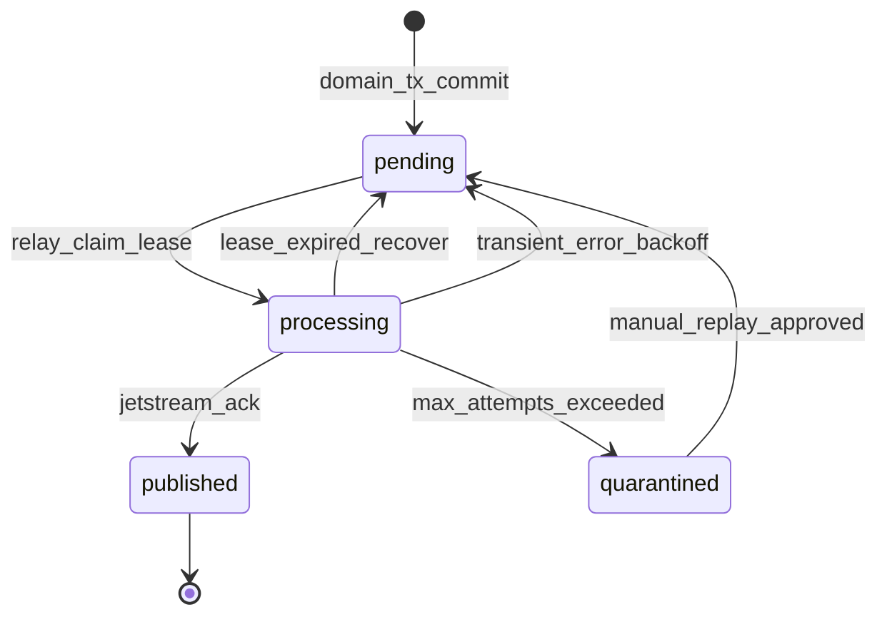
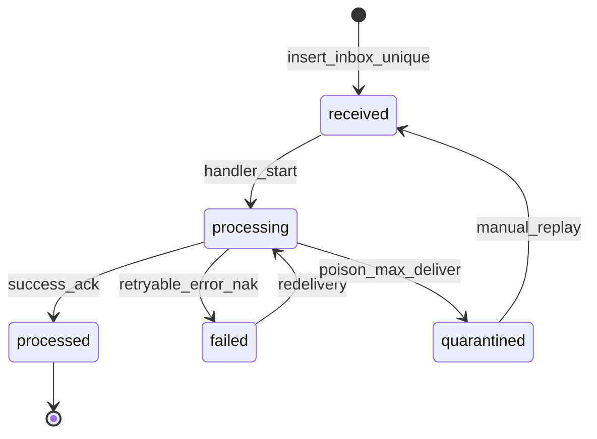

# ADR-0002: Event Envelope, Transactional Outbox/Inbox, and NATS JetStream Topology

- **Status:** Accepted
- **Date:** 2026-08-30
- **Deciders:** platform architecture review (Wave 1 integration)
- **Workstream:** W1-B
- **Implementation allowed:** no — accepted architectural decision; numeric defaults and capacity proof remain implementation gates

Label key: **[evidence]** verified from repository or legacy audit; **[proposal]** recommended design not yet accepted; **[decision]** binding only after acceptance; **[assumption]** engineering default pending validation; **[unresolved policy]** requires named deciders.

---

## Context

**[evidence]** The HUDHUD platform monorepo (`hudhud_platform_backend`) targets independently deployable FastAPI services communicating via NATS JetStream with at-least-once delivery, transactional outbox on producers, and durable idempotent inbox on consumers (`architecture/invariants.md` §Messaging; `AGENTS.md`).

**[evidence]** Legacy (`hudhud-backend` @ `2e375057fdf9b9ce8416408a4436303be5301def`) is a single PostgreSQL monolith with in-process module calls, no NATS, and no cross-service event bus (`docs/audit/legacy-runtime-inventory.md` §Messaging & Async). It does contain partial outbox and idempotency patterns that inform — but do not dictate — platform design.

**[evidence]** Multiple legacy modules directly mutate `shipments.current_status` (pickup, hub, linehaul, delivery_task) violating the platform invariant that Shipment is the sole canonical lifecycle writer (`docs/audit/legacy-data-ownership-inventory.md`). Platform extraction requires replacing direct calls with versioned facts/commands over JetStream.

**[evidence]** `architecture/service-boundaries.yaml` already names provisional event subjects (e.g. `shipment.lifecycle.changed`, `pickup.fact.accepted`, `delivery.fact.cod_collected`) but does not define envelope shape, stream topology, or outbox/inbox mechanics.

**[proposal]** This ADR defines the cross-service messaging foundation — envelope schema, JetStream topology, outbox relay, inbox consumption, compatibility policy, and operational guardrails — without implementing schemas, NATS configuration, or service code.

### Verified legacy messaging evidence

| Pattern | Legacy evidence | Platform implication |
|---------|-----------------|----------------------|
| No message broker | No NATS/Redis queue in compose; in-process calls primary (`legacy-runtime-inventory.md`) | Greenfield JetStream design |
| Push outbox table | `notification_push_outbox` with status, `attempt_count`, `next_attempt_at`, `dedupe_key` (`notification/infrastructure/push_outbox_models.py`) | Validates outbox + lease + retry model |
| Outbox worker | `PushOutboxWorker`: recover stale leases → claim batch (commit) → process each row (commit) (`push_outbox_worker.py`) | Relay crash-recovery pattern |
| Shipment event log | `shipment_events` append-only table: `event_type`, `occurred_at`, `actor_type`, `metadata_jsonb` (`shipment/infrastructure/models.py`) | Domain event sourcing within monolith; maps to `aggregate_version` |
| Notification catalog | `event_catalog.py`: stable keys (`shipment.created`), dedupe templates, entity types | Precedent for `event_type` naming and idempotency keys |
| Synchronous notification emit | `emit_shipment_notifications.py` called from pickup/hub/linehaul/delivery use cases | Must become async integration events |
| Wallet idempotency | `cod_collected:{shipment_id}` ledger key (`credit_cod_collection.py`) | Consumer idempotency by business key |
| HTTP idempotency | Send-parcel confirm: payload-bound `idempotency_key` (`confirm_send_parcel.py`) | API idempotency ≠ event idempotency; both needed |
| Request correlation | `X-Request-ID` middleware (`request_id.py`) | Maps to `correlation_id`; no W3C `traceparent` today |
| Tracking projection | Read-only queries on shipments/events (`tracking` module) | Consumer projection pattern |
| Distributed tracing | Not evidenced (`legacy-runtime-inventory.md` §Observability) | `traceparent` is net-new |

**[evidence]** Legacy dirty file `scripts/dev_pickup_driver_simulator.py` was not inspected or modified during this ADR preparation.

---

## Message taxonomy

**[proposal]** Distinguish five message classes. All share the same physical envelope; semantics differ by `message_kind` metadata and subject prefix.

| Class | Direction | Writer | Consumer behavior | Example |
|-------|-----------|--------|-------------------|---------|
| **Domain event** | Internal to owning service | Aggregate transaction | Optional internal handlers | `ShipmentCreated` persisted to local event store |
| **Integration event** | Cross-service fact | Outbox after commit | Inbox + idempotent handler | `pickup.fact.accepted` |
| **Command** | Intent to act | Authorized caller | Inbox + idempotent command handler | `delivery.command.complete` |
| **Reply/result** | Response to command | Command handler | Correlates via `causation_id` | `shipment.result.lifecycle_updated` |
| **Projection update** | Derived read model | Consumer service | Upsert idempotent projection row | Tracking timeline row from `shipment.lifecycle.changed` |

**[proposal]** Commands require explicit authorization at the handler (service credential or signed internal token per future identity ADR). Integration events are immutable facts. Replies are optional; prefer polling/query when reply is not needed.

---

## Options

### Event envelope serialization

| Option | Summary | Trade-offs |
|--------|---------|------------|
| A. JSON (UTF-8) | Human-readable, broad tooling | Larger payloads; numeric precision care |
| B. Protobuf | Compact, schema-enforced | Harder debug; codegen per service |
| C. CloudEvents wrapper only | Interop standard | Still needs payload schema inside `data` |

### JetStream stream topology

| Option | Summary | Trade-offs |
|--------|---------|------------|
| 1. One platform stream | Single `HUDHUD_EVENTS` stream, all subjects | Simple ops; noisy blast radius; coarse retention/ACL |
| 2. Stream per bounded context | e.g. `HUDHUD_SHIPMENT`, `HUDHUD_PICKUP` | Clear ownership; more streams to operate |
| 3. Stream per retention/security class | e.g. `HUDHUD_OPS` (7d), `HUDHUD_AUDIT` (365d) | Uniform retention policy; subjects span contexts |
| 4. Hybrid (context streams + compliance stream) | Operational streams per context; optional audit/compliance stream | Balanced isolation and operability; moderate complexity |

### Consumer delivery mode

| Option | Summary | Trade-offs |
|--------|---------|------------|
| P. Push (queue group) | Server pushes to subscribers | Simple; back-pressure harder |
| Q. Pull (durable) | Workers fetch batches | Better flow control; recommended for inbox workers |

### Outbox relay

| Option | Summary | Trade-offs |
|--------|---------|------------|
| R1. Embedded poller per service | Same process as API | Fewer moving parts; scales with API pods |
| R2. Dedicated relay sidecar/worker | Separate deployment | Independent scaling; extra deployable |
| R3. Shared relay service | Central dispatcher | Violates service ownership; **rejected** |

---

## Decision drivers

Ranked constraints dominating this design:

1. **[evidence]** Platform invariants mandate at-least-once JetStream, idempotent consumers, and a defined envelope field set (`architecture/invariants.md`).
2. **[evidence]** Shipment is sole canonical lifecycle writer; operational contexts publish facts/commands only (`ownership-matrix.yaml`).
3. **[evidence]** One-writer database cutover; no bidirectional dual-write (`invariants.md` §Database Extraction).
4. **[evidence]** 16 GB single-host Compose target — no quorum/HA pretense for initial JetStream deployment.
5. **[proposal]** Operational safety: poison-message isolation must not block entire platform stream.
6. **[proposal]** Independent service deployability — each service owns outbox, inbox, relay, and consumer credentials.
7. **[proposal]** Replayability for recovery and new projections without replaying side effects.
8. **[unresolved policy]** Tenant isolation depth (shared streams vs dedicated) pending merchant scale and compliance review.

---

## Decision

**[decision]** The platform adopts:

1. **Envelope:** Versioned JSON (UTF-8) CloudEvents-inspired structure with required fields listed below; initial provisional default max payload 256 KiB (capacity proof required before freezing); large media by reference URI only.
2. **Delivery semantics:** At-least-once end-to-end. Producers MUST NOT claim exactly-once. Consumers MUST be idempotent via durable inbox deduplication on `(consumer_name, event_id)`.
3. **Outbox:** Per-service `integration_outbox` table written in the same DB transaction as domain mutation; relay publishes to JetStream and marks `published_at` only after broker ACK.
4. **Inbox:** Per-service `integration_inbox` table; insert-before-handler with unique `(consumer_name, event_id)`; handler runs only on first insert.
5. **JetStream topology:** Hybrid — one stream per publishing bounded context (operational), plus optional `HUDHUD_AUDIT` stream for transport of audit-class events within a bounded retention window.
6. **Durable consumers:** One durable identity per **consuming service and logical subscription/projection** — not one global durable for an entire stream when multiple independent services must each receive messages. Replicas of the same consumer group share one durable; different services or projections use different durables. A durable is **not** created per individual event instance. Subject filters limit each durable's subscription scope.
7. **Ordering:** Per-aggregate FIFO via subject shard `...{aggregate_id}` and single active consumer per `(consumer, aggregate_type, aggregate_id)` partition; no global ordering.
8. **Poison messages:** `MaxDeliver` + exponential backoff → quarantine subject/stream; manual replay tooling required before re-drive.

**Status: Accepted.** Numeric retention, retry, AckWait, and message-size values in this ADR are
**initial provisional defaults** — not accepted production facts. Capacity tests and operational
evidence are required before freezing them.

**Implementation gate:** Schemas, NATS configuration, relay workers, and Compose placement remain
blocked until capacity proof and dependent context ADRs permit the target wave.

---

## Proposed event envelope

### Serialization and naming

| Aspect | Specification |
|--------|---------------|
| Format | **[proposal]** JSON, UTF-8, `Content-Type: application/json` |
| Wire encoding | Single JSON object per message; no batching in v1 |
| Field naming | `snake_case` JSON keys |
| Time format | RFC 3339 UTC with millisecond precision, suffix `Z` (e.g. `2026-08-30T14:32:01.123Z`) |
| UUID format | RFC 4122 string lowercase (e.g. `550e8400-e29b-41d4-a716-446655440000`) |
| `event_type` | Dot-separated lowercase: `{context}.{kind}.{name}` — e.g. `shipment.fact.lifecycle_changed` |
| `event_version` | Positive integer schema version for that `event_type` (starts at `1`) |
| `producer` | Service name matching deployable id (e.g. `pickup`, `shipment`, `gateway` forbidden as event producer) |
| `message_kind` | Enum: `domain` \| `integration` \| `command` \| `reply` \| `projection` |
| Subject mapping | `hudhud.{producer}.{message_kind}.{event_type}.v{event_version}` with `event_type` dots preserved |

### Field specification

| Field | Type | Required | Description |
|-------|------|----------|-------------|
| `event_id` | UUID string | **yes** | Unique idempotency key for this message instance; generated by producer at emission time |
| `event_type` | string (max 128) | **yes** | Stable logical type; versioned independently via `event_version` |
| `event_version` | integer ≥ 1 | **yes** | Payload schema version for this `event_type` |
| `occurred_at` | RFC 3339 datetime | **yes** | When the business fact happened (may differ from `published_at`) |
| `published_at` | RFC 3339 datetime | no | Set by outbox relay at JetStream publish time |
| `producer` | string (max 64) | **yes** | Publishing service identity |
| `aggregate_type` | string (max 64) | conditional | **Required** for aggregate-scoped commands and events; explicitly nullable or absent only for documented non-aggregate platform messages (e.g. platform health, global config broadcasts) |
| `aggregate_id` | UUID string | conditional | **Required** when `aggregate_type` is present |
| `aggregate_version` | integer ≥ 0 | conditional | **Mandatory** whenever ordering or optimistic concurrency applies; required with `aggregate_type` for lifecycle commands/events; may be absent only for documented non-aggregate messages |
| `correlation_id` | UUID string | **yes** | End-to-end business flow id (propagate from HTTP `X-Request-ID` or generate) |
| `causation_id` | UUID string | no | `event_id` of the message that directly caused this one |
| `traceparent` | string (W3C) | no | `00-{trace-id}-{parent-id}-{flags}` per W3C Trace Context |
| `tracestate` | string | no | Optional W3C tracestate |
| `tenant_id` | UUID string | conditional | **Required** when event is merchant-scoped; omitted for platform-global events |
| `organization_id` | UUID string | no | Optional parent org for multi-tenant hierarchies |
| `message_kind` | string enum | **yes** | See taxonomy above |
| `schema_uri` | string (URI) | no | Optional link to contract repo path for this `event_type` version |
| `payload` | object | **yes** | Event-specific body; must not duplicate envelope identity fields |
| `metadata` | object | no | Non-domain key-value (see below) |
| `data_classification` | string enum | **yes** | `public` \| `internal` \| `confidential` \| `restricted` |
| `pii_present` | boolean | **yes** | If `true`, payload MUST NOT contain raw PII in logs/metrics |
| `content_digest` | string | no | Optional SHA-256 of canonical JSON `payload` for integrity audits |

### Metadata object (optional)

| Key | Type | Purpose |
|-----|------|---------|
| `source_ip` | string | Originating client IP when event stems from HTTP |
| `actor_type` | string | `user`, `service`, `system` |
| `actor_id` | UUID | User or service principal id |
| `locale` | string | BCP 47 locale for notification projections |
| `replay` | boolean | `true` if re-published during reconciliation replay |
| `replay_source` | string | `outbox_backfill`, `quarantine_replay`, `manual` |
| `idempotency_key` | string | Client-supplied HTTP idempotency key when applicable |
| `media_refs` | array | `[{ "ref_type": "s3", "bucket": "...", "key": "...", "content_type": "..." }]` |

### Sensitive data restrictions

**[proposal]**

- Forbidden in envelope and payload: passwords, OTP codes, JWTs, API keys, device push tokens, full payment card numbers, national IDs.
- Phone numbers and addresses: allowed in `confidential` events only; consumers MUST NOT log payload at INFO level.
- Evidence photos/videos: `media_refs` URIs only; never inline base64 in JetStream messages.
- `data_classification: restricted` events route only to streams with encrypted-at-rest storage and tightened NATS ACLs.

### Payload size

**[proposal]**

- **Soft limit:** 64 KiB JSON serialized — typical operational events.
- **Hard limit:** 256 KiB — relay rejects larger outbox rows to dead-letter/quarantine table.
- **Large media:** Use `metadata.media_refs` pointing to MinIO/S3 object keys; consumers fetch out-of-band with service credentials.

### Schema versioning and compatibility

**[proposal]**

| Rule | Policy |
|------|--------|
| Backward compatible change | Add optional JSON fields; bump not required but patch note in contract |
| Backward incompatible change | Increment `event_version`; consumers subscribe to both during migration window |
| Forward compatibility | Consumers MUST ignore unknown JSON fields (`json` "tolerant reader") |
| Deprecation | Old `event_version` supported ≥ 90 days after new version first published |
| Removal | Only after zero consumers on old version (metric-gated) |
| Contract location | `contracts/events/{event_type}/v{N}.json` — **future**; not created in this ADR |

### Example JSON envelope

```json
{
  "event_id": "7c9e6679-7425-40de-944b-e07fc1f90ae7",
  "event_type": "pickup.fact.accepted",
  "event_version": 1,
  "occurred_at": "2026-08-30T11:15:42.456Z",
  "producer": "pickup",
  "aggregate_type": "shipment",
  "aggregate_id": "a1b2c3d4-e5f6-7890-abcd-ef1234567890",
  "aggregate_version": 4,
  "correlation_id": "f47ac10b-58cc-4372-a567-0e02b2c3d479",
  "causation_id": "6ba7b810-9dad-11d1-80b4-00c04fd430c8",
  "traceparent": "00-4bf92f3577b34da6a3ce929d0e0e4736-00f067aa0ba902b7-01",
  "tenant_id": "3fa85f64-5717-4562-b3fc-2c963f66afa6",
  "message_kind": "integration",
  "data_classification": "internal",
  "pii_present": false,
  "payload": {
    "pickup_task_id": "2f9b2c8e-1a3d-4e5f-9b8c-7d6e5f4a3b2c",
    "hub_id": "8d2e1f0a-9b8c-7d6e-5f4a-3b2c1d0e9f8a",
    "scan_method": "qr",
    "previous_status": "in_custody",
    "observed_status": "in_custody"
  },
  "metadata": {
    "actor_type": "user",
    "actor_id": "c0ffee00-0000-4000-8000-000000000001",
    "replay": false
  }
}
```

---

## JetStream topology

### Options evaluated (summary)

| Option | Ops complexity | Blast radius | Retention flexibility | ACL granularity | Verdict |
|--------|----------------|--------------|----------------------|-----------------|---------|
| 1. One platform stream | Low | High | Low | Low | **[proposal]** Reject for production |
| 2. Stream per context | Medium | Low | Medium | High | **[proposal]** Accept for operational events |
| 3. Stream per retention class | Medium | Medium | High | Medium | **[proposal]** Accept for audit/compliance |
| 4. Hybrid (2 + 3) | Medium-high | Low | High | High | **[proposal]** **Recommended** |

### Proposed stream layout

**[proposal]** Initial streams (single-node JetStream; file storage). Retention ages, message
size, and replica counts are **provisional defaults** pending capacity tests:

| Stream name | Subjects | Publishers | Retention | Max age (provisional) | Storage | Replicas |
|-------------|----------|------------|-----------|----------------------|---------|----------|
| `HUDHUD_SHIPMENT` | `hudhud.shipment.>` | shipment | Limits | 7d | File | 1 |
| `HUDHUD_PICKUP` | `hudhud.pickup.>` | pickup | Limits | 7d | File | 1 |
| `HUDHUD_HUB` | `hudhud.hub.>` | hub | Limits | 7d | File | 1 |
| `HUDHUD_LINEHAUL` | `hudhud.linehaul.>` | linehaul | Limits | 7d | File | 1 |
| `HUDHUD_DELIVERY` | `hudhud.delivery.>` | delivery | Limits | 7d | File | 1 |
| `HUDHUD_WALLET` | `hudhud.wallet.>` | wallet_cod | Limits | 30d | File | 1 |
| `HUDHUD_NOTIFICATION` | `hudhud.notification.>` | notification | Limits | 3d | File | 1 |
| `HUDHUD_AUDIT` | `hudhud.audit.>` | any (audit emitters) | Limits | 365d (provisional transport window) | File | 1 |
| `HUDHUD_DLQ` | `hudhud.dlq.>` | relay/consumers | Limits | 30d (provisional) | File | 1 |

**[decision]** JetStream is **not** the permanent legal or accounting audit store. The **Audit**
bounded-context service owns long-term searchable audit retention. JetStream supports transport
and bounded-window replay only. The `HUDHUD_AUDIT` stream max age (365d provisional) is an
operational default — not a compliance guarantee.

**[decision]** Single-node JetStream with `replicas: 1` provides durability on one host but
**not** HA or quorum. Loss of the host loses availability until recovery; disk-backed messages
survive process restart on the same host only.

**[assumption]** Additional streams (order, merchant, auth) added when those contexts gain publish contracts.

### Subject and durable naming alternatives

**Subject patterns (choose one per stream):**

| Alt | Pattern | Example | Notes |
|-----|---------|---------|-------|
| S1 | `hudhud.{producer}.{kind}.{event_type}.v{ver}` | `hudhud.pickup.integration.pickup.fact.accepted.v1` | Explicit; longer |
| S2 | `hudhud.{producer}.{event_type}.v{ver}` | `hudhud.pickup.pickup.fact.accepted.v1` | **[proposal]** Recommended — `message_kind` in envelope |
| S3 | `hudhud.{event_type}.v{ver}` | `hudhud.pickup.fact.accepted.v1` | Loses producer in subject; harder ACL |

**Durable consumer naming:**

| Alt | Pattern | Example | Verdict |
|-----|---------|---------|---------|
| D1 | `{consumer_service}_{event_type}_v{ver}` | `shipment_pickup_fact_accepted_v1` | Per-event-type — many durables |
| D2 | `{consumer_service}_{aggregate}_v{ver}` | `shipment_shipment_v1` | Per aggregate type |
| D3 | `{consumer_service}_inbox_v1` | `shipment_inbox_v1` | **Rejected** when multiple independent services share one stream — implies one global consumer |
| D4 | `{consumer_service}_{projection}_v{ver}` | `finance_cod_collected_v1`, `tracking_lifecycle_v1` | **[decision] Recommended** — one durable per consuming service and logical subscription/projection |

**[decision]** Durable consumer semantics:

- **One durable identity** per consuming service and logical subscription/projection (D4).
- **Replicas** of the same consumer group (horizontal scale of one handler) share **one** durable.
- **Different services** or **different projections** within a service use **different** durables.
- **Inbox deduplication** remains per `(consumer_name, event_id)` where `consumer_name` matches the durable identity.
- **Subject filters** (`FilterSubject`) limit each durable's subscription — a durable is **not** created per individual event instance.
- **Rejected:** one global/shared durable consumer for an entire stream when multiple independent services must each receive the messages.

**[proposal]** Use **S2** subjects and **D4** durables with filter subjects per consumer interest (e.g. `hudhud.pickup.pickup.fact.>` for Shipment's pickup-fact durable; `hudhud.delivery.delivery.fact.cod_collected.v1` for Finance's COD durable).

### JetStream consumer configuration

**[proposal]** Pull consumers for inbox workers. Values below are **provisional defaults**:

| Setting | Provisional default | Rationale |
|---------|---------------------|-----------|
| `AckPolicy` | `explicit` | Process-after-inbox-insert |
| `AckWait` | 30s initial (tune per handler) | Must exceed p99 handler + DB commit |
| `MaxDeliver` | 5 | After 5 attempts → poison path |
| `BackOff` | `[5s, 30s, 2m, 10m, 30m]` | Exponential-style via JetStream backoff |
| `MaxAckPending` | 100 per consumer | Back-pressure |
| `DeliverPolicy` | `all` (new) / `by_start_sequence` (replay) | Replay uses new ephemeral consumer |
| `ReplayPolicy` | `instant` (catch-up) / `original` (reconciliation) | |
| `DuplicateWindow` | 2m | Dedup on `Nats-Msg-Id` = `event_id` at publish |
| `FlowControl` | enabled | Pull consumer flow control |
| `MaxWaiting` | 512 | Pull batch waiters |

**[evidence]** JetStream on a single Compose node provides durability on disk but **not** quorum HA. **[proposal]** Document `replicas: 1` explicitly; future HA migration requires NATS cluster (3+ nodes) and stream replica increase — out of initial scope.

### Ordering guarantees and limits

**[proposal]**

- **Guaranteed:** Messages with the same `aggregate_id` published by the same producer are consumed in `aggregate_version` order when a single pull worker processes that partition.
- **Not guaranteed:** Global order across aggregates, across producers, or across streams.
- **Scaling limit:** Increase consumers by partitioning on `aggregate_id` hash only when handler is provably partition-independent; lifecycle commands for one shipment MUST stay single-threaded per aggregate.

### Tenant isolation

| Approach | Isolation | Cost | Verdict |
|----------|-----------|------|---------|
| Shared streams + `tenant_id` in envelope | Logical | Low | **[proposal]** v1 default |
| Subject prefix per tenant | Stronger | High subject cardinality | **[unresolved policy]** |
| Stream per large merchant | Strongest | Ops burden | Defer |

### Service permissions (NATS ACL)

**[proposal]** Per-service NGS/NATS user:

| Service | Publish | Subscribe |
|---------|---------|-----------|
| pickup | `hudhud.pickup.>` | `hudhud.shipment.shipment.result.>` (if replies used) |
| shipment | `hudhud.shipment.>` | `hudhud.pickup.>`, `hudhud.hub.>`, `hudhud.linehaul.>`, `hudhud.delivery.>` |
| tracking | — | `hudhud.shipment.shipment.fact.>` |
| notification | `hudhud.notification.>` | `hudhud.shipment.>` |
| gateway | — | — (no business publish) |

Credentials scoped per service; no shared platform superuser in application pods.

### Local single-node limitations and future HA

**[evidence]** Platform targets 16 GB single-host Compose (`legacy-runtime-inventory.md` §Host Constraints).

**[proposal]**

- Single JetStream server: no R1→R3 upgrade without maintenance window.
- Disk full on stream storage is a severity-1 outage — monitor `jetstream_storage_bytes`.
- Future HA: 3-node NATS cluster, streams `replicas: 3`, consumers stay pull-based, DNS/load-balanced `nats://` endpoints, documented cutover from standalone.

---

## Transactional outbox

### Transaction boundary

**[proposal]** Outbox row inserted in the **same database transaction** as the domain mutation (same pattern legacy uses for in-app notification + push outbox, but scoped per service DB).

```
BEGIN;
  UPDATE shipments SET current_status = ...;
  INSERT INTO shipment_events (...);
  INSERT INTO integration_outbox (event_id, subject, payload_json, ...);
COMMIT;
```

If commit fails, no message is visible to relay. If commit succeeds, relay eventually publishes.

### Outbox table (per service)

**[proposal]** Minimum columns:

| Column | Type | Notes |
|--------|------|-------|
| `id` | UUID PK | Row id |
| `event_id` | UUID UNIQUE | Envelope `event_id` |
| `subject` | string | JetStream subject |
| `payload_json` | JSONB | Full envelope |
| `status` | enum | `pending`, `processing`, `published`, `failed`, `quarantined` |
| `attempt_count` | int | Default 0 |
| `next_attempt_at` | timestamptz | Scheduled relay time |
| `processing_owner` | string | Relay instance id |
| `processing_until` | timestamptz | Lease expiry |
| `published_at` | timestamptz | Set on broker ACK |
| `last_error` | text | Sanitized (no secrets) |
| `created_at` | timestamptz | |

Index: `(status, next_attempt_at)` where `status IN ('pending', 'processing')`.

### Relay behavior

**[proposal]** Modeled on legacy `PushOutboxWorker` **[evidence]**:

1. **Recover** stale `processing` rows where `processing_until < now()` → reset to `pending`.
2. **Claim** batch: `UPDATE ... SET status=processing, processing_owner=?, processing_until=? WHERE status=pending AND next_attempt_at <= now() LIMIT N RETURNING id` — commit claim.
3. **Publish** each row to JetStream with `Nats-Msg-Id: {event_id}` header.
4. On broker ACK → `status=published`, `published_at=now()` — per-row commit.
5. On transient failure → increment `attempt_count`, schedule `next_attempt_at` with backoff.
6. On permanent failure / max attempts → `status=quarantined`, copy to `HUDHUD_DLQ` subject.

**[proposal]** Relay runs as embedded task in service process (option R1) for v1; sidecar (R2) remains migration path.

### Outbox lifecycle diagram



---

## Durable idempotent inbox

### Inbox table (per consumer service)

| Column | Type | Notes |
|--------|------|-------|
| `id` | UUID PK | |
| `consumer_name` | string | Durable consumer id |
| `event_id` | UUID | Envelope `event_id` |
| `event_type` | string | Denormalized for queries |
| `aggregate_id` | UUID | |
| `status` | enum | `received`, `processing`, `processed`, `failed`, `quarantined` |
| `received_at` | timestamptz | |
| `processed_at` | timestamptz | |
| `handler_version` | string | Code version for replay audits |
| `last_error` | text | Sanitized |
| `payload_json` | JSONB | Optional copy for replay |

**Unique constraint:** `(consumer_name, event_id)` — deduplication gate.

### Consumer idempotency

**[proposal]** Handler flow:

1. Pull message from JetStream.
2. `INSERT INTO integration_inbox ... ON CONFLICT DO NOTHING RETURNING id`.
3. If no row returned → duplicate → `ACK` immediately (already processed or in flight).
4. If row returned → run business handler (idempotent by `event_id` + domain keys e.g. `cod_collected:{shipment_id}`).
5. On success → `status=processed`, `ACK`.
6. On retryable failure → `NAK` or `ACK` with delayed redelivery per policy.
7. On poison → `status=quarantined`, `ACK` to stop redelivery, alert operator.

### Crash recovery

| Scenario | Behavior |
|----------|----------|
| Crash after inbox insert, before handler | Row `received`/`processing`; relay redelivers; handler re-enters idempotently |
| Crash after handler, before ACK | Redelivery; inbox conflict → skip side effects, ACK |
| Crash after ACK | At-most-once handler side effects acceptable only if handler fully idempotent |

### Multi-replica safety

**[proposal]** Multiple relay replicas: lease columns prevent double publish. Multiple inbox workers on same durable: JetStream queue semantics distribute messages; inbox unique constraint prevents double processing.

### Inbox lifecycle diagram



---

## Retry and poison-message flow

```mermaid
flowchart TD
    A[Message delivered] --> B{Inbox insert new?}
    B -->|no| C[ACK duplicate]
    B -->|yes| D[Run handler]
    D --> E{Success?}
    E -->|yes| F[Mark processed ACK]
    E -->|no retryable| G[NAK / backoff]
    G --> H{Deliver count < MaxDeliver?}
    H -->|yes| A
    H -->|no| I[Quarantine inbox row]
    I --> J[Publish to hudhud.dlq.{consumer}]
    J --> K[ACK original stop redelivery]
    K --> L[Alert on-call]
    L --> M{Manual fix?}
    M -->|replay| N[Republish from quarantine tool]
    N --> A
```

**[proposal]** Poison isolation: quarantined messages never block sibling consumers on the same stream. DLQ retention 30 days minimum. Replay requires operator auth and emits `metadata.replay=true`.

---

## Event compatibility policy

**[proposal]**

1. All published `event_type` + `event_version` pairs registered in `contracts/events/` before first publish (enforced in CI when contracts exist).
2. Consumers declare supported versions in service manifest.
3. Adding optional fields: minor compatible — no version bump required.
4. Renaming/removing required payload fields: new `event_version` required.
5. Dual-subscribe period: consumer handles `v1` and `v2` concurrently during migration.
6. Breaking change approval: owning bounded context team + affected consumer teams.

---

## Observability and SLO signals

**[proposal]**

| Signal | Type | Purpose |
|--------|------|---------|
| `outbox_pending_count` | gauge | Relay backlog |
| `outbox_age_seconds` | histogram | Publish lag SLO |
| `outbox_publish_total` | counter | By status |
| `inbox_duplicate_total` | counter | Idempotency effectiveness |
| `inbox_handler_duration_seconds` | histogram | Consumer health |
| `jetstream_consumer_num_pending` | gauge | Broker-side backlog |
| `jetstream_consumer_delivered` | counter | Throughput |
| `dlq_depth` | gauge | Poison rate |

**SLO targets (initial):**

- p95 outbox publish lag < 5s under normal load
- p99 inbox handler < 30s for operational facts
- DLQ depth = 0 sustained > 1h (alert)

Logs MUST include `event_id`, `correlation_id`, `traceparent`, `aggregate_id`, `event_type` — never raw confidential payload.

---

## Testing strategy

**[proposal]**

| Layer | Tests |
|-------|-------|
| Contract | JSON Schema validation per `event_type` version |
| Outbox unit | Same-transaction insert; rollback leaves zero outbox rows |
| Relay integration | Testcontainers NATS; claim lease; crash recovery; ACK marks published |
| Inbox integration | Duplicate `event_id` does not double side effects |
| Ordering | Same `aggregate_id` events processed in `aggregate_version` order |
| Poison | Force handler failure → lands in DLQ after `MaxDeliver` |
| Failure injection | Kill relay mid-batch; kill consumer post-handler pre-ACK |
| Replay | Re-publish quarantined event with `replay=true` → idempotent |
| Load | Sustained publish rate within single-node disk budget |

---

## Migration implications

**[evidence]** Legacy uses synchronous in-process calls and direct status mutation.

**[proposal]** Phased migration per bounded context:

1. **Phase 0:** Stand up single-node JetStream in Compose (no production traffic).
2. **Phase 1:** Shipment service publishes `shipment.fact.lifecycle_changed` from existing `shipment_events` semantics; tracking consumes as projection.
3. **Phase 2:** Pickup/hub/linehaul publish facts; shipment stops accepting direct status writes from extracted services.
4. **Phase 3:** Delivery publishes `delivery.fact.cod_collected`; Finance consumes (not direct Delivery→Wallet); Shipment consumes delivery completion facts per ADR-0003.
5. **Phase 4:** Decommission in-process `emit_shipment_notifications` equivalents in favor of notification consumer.

**[evidence]** One-writer cutover per database; no bidirectional dual-write. During transition, feature flags gate publish vs direct-call fallback per service extraction ADR.

---

## Security

**[proposal]**

- Service-to-service identity via NATS credentials (NKey/JWT) — details in identity/trust ADR.
- Do not trust `X-User-Id` or similar forwarded HTTP headers on async consumers.
- Envelope `data_classification` drives log redaction and stream ACL.
- PII-minimized payloads; references for evidence media.
- Outbox/inbox tables in service-scoped databases only.
- Sanitize `last_error` columns (pattern from legacy `sanitize_provider_error_message`).

---

## Rollback

| Stage | Rollback action |
|-------|-----------------|
| Pre-cutover | Disable relay; domain commits continue; outbox accumulates |
| Consumer failure | Pause durable consumer; fix handler; replay from inbox `received` rows |
| Schema breakage | Pin `event_version`; halt producer bump |
| JetStream outage | API remains up; outbox backs up; alert on lag SLO |
| Irreversible facts | Physical delivery and COD collection cannot be "rolled back" — compensating events only |

**[evidence]** Finance failures must not roll back physical delivery (`invariants.md`).

---

## Consequences

### Positive

- Clear cross-service contract replacing monolith coupling.
- At-least-once with idempotent consumers — honest semantics.
- Per-context stream isolation limits poison blast radius.
- Replay enables new projections (tracking, control tower) without source redeploy.
- Aligns with existing legacy outbox/idempotency mental models.

### Negative

- Operational complexity vs monolith function calls.
- Single-node JetStream is a availability bottleneck until clustered.
- End-to-end latency increases vs synchronous calls.
- Every consumer must implement inbox + idempotency correctly.

### Neutral

- JSON verbosity vs future Protobuf optimization path remains open.
- Hybrid stream count grows with bounded contexts.

---

## Unresolved questions

1. **[unresolved policy]** Exact tenant isolation model — shared streams vs dedicated merchant streams.
2. **[unresolved policy]** Command authorization token format and issuer (depends on identity/trust ADR).
3. **[unresolved policy]** Whether `organization_id` is required for all merchant events or only enterprise tier.
4. **[unresolved policy]** Audit stream mandatory emitters list and legal retention period beyond 365d proposal.
5. **[unresolved policy]** Sidecar relay (R2) vs embedded relay (R1) as default deployable pattern.
6. **[unresolved policy]** Maximum acceptable outbox lag during incident (exact SLO numeric approval).
7. **[unresolved policy]** CloudEvents strict compliance vs HUDHUD-native envelope only.
8. **[assumption]** NATS JetStream version bundled with chosen `nats:2.x` image — verify feature support at implementation time.

---

## Dependencies on other ADRs

| ADR | Dependency |
|-----|------------|
| ADR-0001 | Deployable grouping / Compose topology — JetStream service placement and resource limits |
| ADR-0003 | Shipment sole lifecycle writer — shipment consumer enforces facts before lifecycle cutover |
| ADR-0004 | Identity and service trust — NATS credential model and command auth |
| ADR-0005 | Finance settlement — finance/wallet event contracts and posting idempotency |
| ADR-0006 | Data cutover / one-writer — per-service outbox DB ownership timing |

---

## Explicit non-goals

- Implementing event packages, JSON schemas, NATS configuration, or migrations
- Claiming exactly-once delivery
- Treating JetStream as the legal or accounting audit store
- Modifying `architecture/service-boundaries.yaml` or `ownership-matrix.yaml` (updated in Wave 1 integration)
- Clustered NATS HA in initial Compose deployment
- PGMQ or Redis Streams as primary transport
- Gateway publishing business events
- Defining finance settlement event payloads (policy-blocked)

---

## Alternatives considered

| Alternative | Why rejected |
|-------------|--------------|
| Exactly-once Kafka semantics marketing | Dishonest; JetStream is at-least-once; use idempotent consumers |
| Single platform-wide stream | Poison message and retention policy coupling too coarse |
| Shared relay service (R3) | Violates per-service ownership invariant |
| One global durable per stream for all consumers | Independent services miss messages or share handler state incorrectly |
| Protobuf v1 | Higher friction for ADR/bootstrap phase; JSON proposed first |
| Redis Pub/Sub | No durable replay or ack model |
| Direct HTTP only (no events) | Fails operational decoupling and projection scaling |
| Trust forwarded user headers in consumers | Violates security invariant |

---

## Proposed recommendation

**[decision]** Accepted: hybrid per-context stream topology, JSON envelope with fields specified
above, per-service transactional outbox with lease-based relay, durable pull consumers (one per
service/projection) with inbox deduplication on `(consumer_name, event_id)`, explicit poison
quarantine to `HUDHUD_DLQ`, and aggregate-scoped ordering via `aggregate_id` + `aggregate_version`.
Single-node JetStream is a deliberate Phase 0 constraint with a documented path to 3-node HA.
Numeric retention/retry/size defaults require capacity proof before production freeze.

---

## References

- Platform invariants: `architecture/invariants.md`
- Service boundaries: `architecture/service-boundaries.yaml`
- Ownership matrix: `architecture/ownership-matrix.yaml`
- Legacy baseline: `docs/audit/legacy-baseline.md` @ `2e375057fdf9b9ce8416408a4436303be5301def`
- Legacy runtime: `docs/audit/legacy-runtime-inventory.md`
- Legacy data ownership: `docs/audit/legacy-data-ownership-inventory.md`
- Legacy domain inventory: `docs/audit/legacy-domain-inventory.md`
- ADR template: `docs/adr/0000-template.md`
- Legacy push outbox: `hudhud-backend/app/modules/notification/infrastructure/push_outbox_models.py`
- Legacy outbox worker: `hudhud-backend/app/modules/notification/application/push_outbox_worker.py`
- Legacy shipment events: `hudhud-backend/app/modules/shipment/infrastructure/models.py`
- Legacy notification catalog: `hudhud-backend/app/modules/notification/domain/event_catalog.py`
- Legacy wallet idempotency: `hudhud-backend/app/modules/wallet/application/credit_cod_collection.py`

---

## Output contract

```text
ADR path: docs/adr/0002-event-envelope-outbox-inbox-and-jetstream.md
Status: Accepted
Deciders: platform architecture review (Wave 1 integration)
Canonical docs updated: architecture/service-boundaries.yaml (Wave 1 integration)
Unresolved questions: 8 (see section above)
Implementation allowed: no — capacity proof and schema bootstrap required
```
