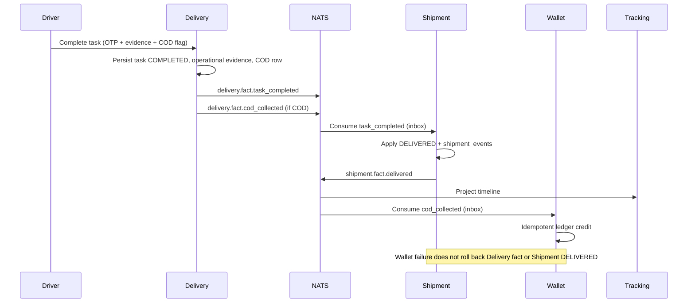
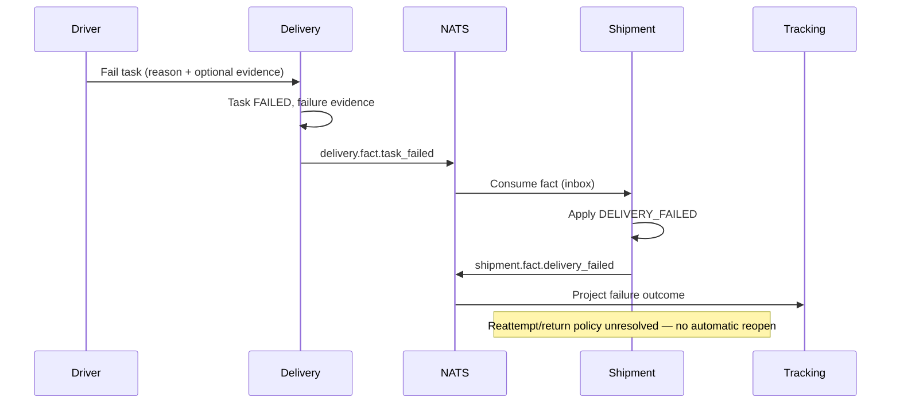

# ADR-0003: Shipment Lifecycle Authority and Irreversible Delivery Facts

- **Status:** proposed
- **Date:** 2026-08-30
- **Deciders:** (pending — platform architecture owners)

Label key: **evidence** = verified from legacy audit; **proposal** = recommended platform design;
**assumption** = engineering default pending policy; **unresolved policy** = business rule not decided.

## Context

**Evidence:** Platform invariant (`architecture/invariants.md`): Shipment is the sole canonical writer
of shipment lifecycle state; Pickup, Hub, Linehaul, and Delivery publish facts or issue commands and
do not directly update canonical Shipment state after cutover. Physical delivery is an irreversible
operational fact; finance failures must not roll back delivery; COD collection and merchant wallet
recognition are separate accounting facts.

**Evidence:** Legacy monolith (`hudhud-backend` @ `2e375057fdf9b9ce8416408a4436303be5301def`) uses a
single PostgreSQL database. At least five modules mutate `shipments.current_status` and
`shipment_events` directly (`docs/audit/legacy-data-ownership-inventory.md`). This violates sole-writer
ownership declared in `architecture/ownership-matrix.yaml`.

**Evidence:** Legacy driver completion (`complete_delivery_task.py`) synchronously creates COD
collection, credits merchant wallet, and marks shipment `DELIVERED` in one request-scoped database
session. Wallet credit failure before status update can block canonical delivery transition — contrary
to platform irreversible-delivery policy.

**Proposal:** This ADR defines the target Shipment aggregate boundary, command/fact separation,
transition authority, irreversible-fact handling, COD decoupling, and reconciliation model required
before implementing the Shipment service state machine. It does **not** implement the state machine
and does **not** accept unresolved business policies.

**Dependencies (pending ADRs):**

| ADR | Topic | Relevance |
|-----|-------|-----------|
| ADR-0002 | Eventing / messaging topology | Command and fact envelopes, outbox/inbox, at-least-once delivery |
| ADR-0005 | Finance / settlement | Cash custody, receipt posting, merchant payable recognition |
| ADR-0006 | Identity and trust | Service-to-service auth for commands; operator override authorization |

## Options

| Option | Summary | Trade-offs |
|--------|---------|------------|
| A — Sole Shipment writer (recommended) | Shipment applies all canonical lifecycle transitions from commands/facts; operational contexts own local state only | Requires cutover from multi-writer legacy; clear ownership; matches invariants |
| B — Shared lifecycle table with row-level triggers | DB triggers enforce single-writer semantics | Hides domain logic in DB; cross-service FK forbidden on platform; poor fit for extracted services |
| C — Dual-write transition period | Operational modules continue writing status during migration | Forbidden by platform cutover policy (one-writer, no bidirectional dual-write) |
| D — Timeline-only canonical model | `current_status` derived from events; no status column | Complex queries; legacy and tracking depend on `current_status`; higher read cost |

## Decision drivers

1. **Binding invariants** — sole lifecycle writer, no cross-service DB access, irreversible physical delivery.
2. **Migration safety** — one-writer cutover per datastore; credential revocation gate.
3. **Operational independence** — Pickup, Hub, Linehaul, Delivery remain deployable bounded contexts.
4. **Auditability** — append-only shipment timeline; reconciliation for conflicts.
5. **Finance separation** — COD and wallet facts must not block or undo physical delivery (ADR-0005 defers accounting detail).

## Decision

**Proposal (not accepted):** Adopt Option A.

After cutover, **only the Shipment service** mutates canonical lifecycle tables (`shipments` lifecycle
columns, `shipment_events`). Pickup, Hub, Linehaul, and Delivery:

- Record **operational evidence** in their own databases (tasks, scans, trips, COD collection rows).
- Publish **facts** (`pickup.fact.*`, `hub.fact.*`, `linehaul.fact.*`, `delivery.fact.*`) or issue
  **commands** (`delivery.command.*`) via NATS (ADR-0002).
- Never hold write credentials for Shipment lifecycle tables post-cutover.

**Physical delivery** is recorded as an operational fact in Delivery first; Shipment transitions to
`DELIVERED` from that fact or an authorized command. Wallet/finance projection failures do not erase
the operational fact or roll back canonical delivery once physically committed.

Implementation of the state machine, schemas, and NATS subjects is **blocked** until this ADR is
accepted and listed unresolved policies are resolved or explicitly deferred with named owners.

## Verified legacy writer matrix

Audit source: `hudhud-backend` @ `2e375057fdf9b9ce8416408a4436303be5301def`.
Inventory method: grep `current_status =`, read use cases, routes, models, and tests.

**Summary:** **13 verified legacy writers** mutate `shipments.current_status` (12 symbols if
`ConfirmSendParcelUseCase` is counted only as orchestrator). **5 modules** violate sole-writer
ownership: `pickup`, `hub`, `linehaul`, `delivery_task`, plus `shipment` ops paths that duplicate
driver paths. `send_parcel` orchestrates creation via `CreateShipmentUseCase` without direct status
mutation.

### Status transition writers

| # | File / symbol | Actor / module | Source → target status | Validation (evidence) | Transaction boundary | Side effects | Idempotency | Tests (evidence) | Sole-writer conflict |
|---|---------------|----------------|------------------------|----------------------|------------------------|--------------|-------------|------------------|----------------------|
| 1 | `shipment/application/create_shipment.py` :: `CreateShipmentUseCase.execute` | Shipment (API / internal) | `null` → `CREATED` | Order must be `VALIDATED` | Single request DB session | `SHIPMENT_CREATED` event, audit, optional in-app notification | None on create | `tests/unit/modules/shipment/test_create_shipment_use_case.py`, `tests/integration/modules/shipment/test_create_shipment_api.py` | Canonical writer — OK |
| 2 | `send_parcel/application/confirm_send_parcel.py` :: `ConfirmSendParcelUseCase.execute` | Send Parcel | Orchestrates → `CREATED` via #1 | Idempotency key + request fingerprint replay | Same session as order + shipment create | Order create, shipment create, pricing metadata | Idempotent replay on matching fingerprint | `tests/integration/modules/send_parcel/test_send_parcel_api.py` | Orchestration only — OK at creation boundary |
| 3 | `pickup/application/acceptance_scan_pickup_task.py` :: `AcceptanceScanPickupTaskUseCase.execute` | Pickup driver | `CREATED` → `IN_CUSTODY` | Task `PROOF_CAPTURED`, shipment `CREATED`, scan match, policy gates, optional courier verification | Single request session | Custody → `PICKUP_DRIVER`; `accepted_at`/`sla_started_at`; pickup task `ACCEPTED`; `PICKUP_ACCEPTANCE_SCAN` event; audit; notifications | Conflict if already accepted | `tests/unit/modules/pickup/test_acceptance_scan_pickup_task_use_case.py`, `tests/integration/modules/pickup/test_acceptance_scan_pickup_task_api.py` | **Violates** — Pickup mutates Shipment |
| 4 | `hub/application/origin_hub_inbound_scan.py` :: `OriginHubInboundScanUseCase.execute` | Hub operator | `IN_CUSTODY` → `AT_ORIGIN_HUB` | Custody `PICKUP_DRIVER`, hub active, scan match, not already at origin hub | Single request session | Custody → `ORIGIN_HUB`; handover manifest processing; `ORIGIN_HUB_INBOUND_SCAN` event; audit; driver notification | Conflict if already at origin hub | `tests/unit/modules/hub/test_origin_hub_inbound_scan_use_case.py`, `tests/integration/modules/hub/test_origin_hub_inbound_scan_api.py` | **Violates** — Hub mutates Shipment |
| 5 | `linehaul/application/dispatch_linehaul_trip.py` :: `DispatchLinehaulTripUseCase.execute` | Linehaul operator | `AT_ORIGIN_HUB` → `IN_LINEHAUL` | Per-shipment status + origin custody; trip dispatchable | Single request session (batch) | Trip `DISPATCHED`; linehaul item `IN_TRANSIT`; custody `LINEHAUL`; events per shipment; notifications (`isolate_failures=True`) | Per-item status re-check | `tests/unit/modules/linehaul/test_dispatch_linehaul_trip_use_case.py`, `tests/integration/modules/linehaul/test_linehaul_dispatch_api.py` | **Violates** — Linehaul mutates Shipment |
| 6 | `linehaul/application/arrive_linehaul_trip.py` :: `ArriveLinehaulTripUseCase.execute` | Linehaul operator | `IN_LINEHAUL` → `AT_DESTINATION_HUB` | Per-shipment `IN_LINEHAUL` + linehaul custody | Single request session (batch) | Trip `ARRIVED`; item `ARRIVED`; custody `DESTINATION_HUB`; events; notifications | Per-item status re-check | Integration linehaul tests | **Violates** — Linehaul mutates Shipment |
| 7 | `delivery_task/application/start_delivery_task.py` :: `StartDeliveryTaskUseCase.execute` | Delivery driver | `AT_DESTINATION_HUB` → `OUT_FOR_DELIVERY` | Task `ACCEPTED`; `assert_can_mark_out_for_delivery` | Single request session | Task `OUT_FOR_DELIVERY`; custody `DELIVERY_DRIVER`; OFD events; audit; notification (failure fails request) | Replay if task+shipment already OFD | `tests/unit/modules/delivery_task/test_delivery_task_use_cases.py` | **Violates** — Delivery mutates Shipment |
| 8 | `delivery_task/application/complete_delivery_task.py` :: `CompleteDeliveryTaskUseCase.execute` | Delivery driver | `OUT_FOR_DELIVERY` → `DELIVERED` | OFD task+shipment; OTP consumed; evidence; `assert_can_mark_delivered`; COD resolution | Single request session | Evidence; optional COD row + **sync wallet credit**; task `COMPLETED`; `SHIPMENT_DELIVERED` + task events; audit; notification | Replay if task `COMPLETED` and shipment `DELIVERED` | `tests/unit/modules/delivery_task/test_complete_delivery_cod_wallet.py`, `tests/integration/modules/delivery_task/test_cod_wallet_credit_api.py` | **Violates** — Delivery mutates Shipment; **couples** COD/wallet in same transaction |
| 9 | `delivery_task/application/fail_delivery_task.py` :: `FailDeliveryTaskUseCase.execute` | Delivery driver | `OUT_FOR_DELIVERY` → `DELIVERY_FAILED` | OFD task+shipment; parsed reason; optional evidence | Single request session | Failure evidence; task `FAILED`; events; audit; notification | Replay if task `FAILED` and shipment `DELIVERY_FAILED` | `tests/unit/modules/delivery_task/test_delivery_task_use_cases.py` | **Violates** — Delivery mutates Shipment |
| 10 | `shipment/application/delivery_completion.py` :: `MarkShipmentOutForDeliveryUseCase.execute` | Operations | `AT_DESTINATION_HUB` → `OUT_FOR_DELIVERY` | `assert_can_mark_out_for_delivery`; no active pre-start task | Shared `_DeliveryCompletionService.apply` | Ops evidence optional; event; audit; notification | Conflict on illegal transition | `tests/unit/modules/shipment/test_delivery_completion_use_cases.py` | Canonical writer — OK (Shipment module) |
| 11 | `shipment/application/delivery_completion.py` :: `MarkShipmentDeliveredUseCase.execute` | Operations | `OUT_FOR_DELIVERY` → `DELIVERED` | `assert_can_mark_delivered`; ops override if active OFD task | `_DeliveryCompletionService.apply` | Ops evidence; may terminalize active task; **no COD/wallet** (Phase 15.1) | Terminal status conflicts | `tests/unit/modules/shipment/test_delivery_completion_use_cases.py` | Canonical writer — OK; diverges from driver COD path |
| 12 | `shipment/application/delivery_completion.py` :: `MarkShipmentDeliveryFailedUseCase.execute` | Operations | `OUT_FOR_DELIVERY` → `DELIVERY_FAILED` | `assert_can_mark_delivery_failed`; ops override | `_DeliveryCompletionService.apply` | Failure evidence; terminalize task | Terminal status conflicts | `tests/unit/modules/shipment/test_delivery_completion_use_cases.py` | Canonical writer — OK |
| 13 | `shipment/application/delivery_completion.py` :: `CancelShipmentDeliveryUseCase.execute` | Operations | `AT_DESTINATION_HUB` or `OUT_FOR_DELIVERY` → `DELIVERY_CANCELLED` | `assert_can_cancel_delivery` | `_DeliveryCompletionService.apply` | Cancellation evidence; terminalize task | Terminal status conflicts | `tests/unit/modules/shipment/test_delivery_completion_use_cases.py` | Canonical writer — OK |

### Timeline event writers (no status change)

**Evidence:** Multiple modules append `shipment_events` without mutating `current_status`:

| Module | Representative symbols | Event types (examples) |
|--------|------------------------|------------------------|
| Pickup | `create_pickup_task`, `scan_pickup_task`, `fail_pickup_task`, `arrive_pickup_task`, `capture_pickup_proof`, `report_pickup_exception` | `PICKUP_TASK_CREATED`, `PICKUP_QR_SCANNED`, `PICKUP_TASK_FAILED`, … |
| Hub | `origin_hub_condition_check` | `ORIGIN_HUB_CONDITION_CHECKED` |
| Linehaul | `assign_shipments_to_linehaul_trip` | `LINEHAUL_SHIPMENT_ASSIGNED` |
| Delivery | `assign_delivery_task`, `accept_delivery_task`, `decline_delivery_task`, `reassign_delivery_task`, `cancel_delivery_task` | `DELIVERY_TASK_ASSIGNED`, `DELIVERY_TASK_ACCEPTED`, … |

**Proposal:** Post-cutover, operational timeline facts remain in each context's event/outbox stream;
Shipment projects customer/ops timeline from canonical `shipment_events` plus subscribed facts.

### COD and wallet writers

| Fact | File / symbol | Module | Notes |
|------|---------------|--------|-------|
| COD collection row | `complete_delivery_task.py` :: `_persist_cod_collection_and_wallet_credit` | `delivery_task` | `delivery_cod_collections` table |
| Wallet ledger credit | `wallet/application/credit_cod_collection.py` :: `CreditCodCollectedToMerchantWalletUseCase.execute` | `wallet` | Idempotency key `cod_collected:{shipment_id}`; skips customer-direct |
| Ops delivered (no COD) | `MarkShipmentDeliveredUseCase` docstring | `shipment` | **Evidence:** ops mark does not create COD or wallet credit |

### Custody / location state

**Evidence:** `shipments.current_custody_type` / `current_custody_id` mutated alongside status in
pickup acceptance, hub inbound, linehaul dispatch/arrive, and delivery start (`CUSTODY_TYPE_*` in
`shipment/domain/enums.py`). Hub sorting/staging beyond inbound scan does not change shipment status
in legacy (`origin_hub_condition_check` appends events only).

## Proposed aggregate boundary

### Canonical Shipment aggregate responsibility

**Proposal:** The Shipment aggregate owns:

- `current_status` (canonical lifecycle enum)
- `current_custody_type` / `current_custody_id` (canonical custody pointer — not operational detail)
- `accepted_at`, `sla_started_at` (lifecycle timestamps tied to canonical transitions)
- Append-only `shipment_events` (canonical timeline entries for status transitions and Shipment-issued facts)
- Shipment-scoped delivery evidence metadata required for customer/ops views (coordination with Media/Proof ADR)

It does **not** own: pickup tasks, hub scans, linehaul trips, delivery tasks, COD collection rows,
wallet ledger, or notification delivery state.

### Aggregate version / concurrency strategy

**Proposal:**

- Optimistic concurrency on `shipments.version` (or `aggregate_version`) incremented on each
  successful transition.
- Commands/facts carry `expected_version` or monotonic `causation_id` for Shipment to reject stale
  writers.
- `SELECT … FOR UPDATE` on aggregate row when applying conflicting final-mile commands.
- Terminal statuses (`DELIVERED`, `DELIVERY_FAILED`, `DELIVERY_CANCELLED`) reject further lifecycle
  commands except reconciliation/admin workflows (unresolved policy for reattempt/return).

### Command versus fact boundaries

| Kind | Producer | Consumer | Examples |
|------|----------|----------|----------|
| **Operational fact** | Pickup, Hub, Linehaul, Delivery | Shipment (inbox) | `pickup.fact.acceptance_scanned`, `hub.fact.origin_inbound_scanned`, `linehaul.fact.trip_dispatched`, `delivery.fact.task_completed` |
| **Command** | Delivery, Operations (via Gateway) | Shipment | `shipment.command.apply_delivery_outcome` (authorized override) |
| **Canonical fact** | Shipment | Tracking, Notification, Control Tower, Finance | `shipment.fact.lifecycle_transitioned`, `shipment.fact.delivered` |

**Proposal:** Facts are immutable observations with producer idempotency keys. Commands request
Shipment to validate and apply a transition; Shipment is the only writer of canonical state.

### Operational evidence versus canonical state

| Layer | Owner | Examples |
|-------|-------|----------|
| Operational evidence | Pickup / Hub / Linehaul / Delivery | Pickup proof images, hub scan records, linehaul manifest items, delivery OTP verification, driver photos |
| Canonical state | Shipment | `current_status`, custody pointer, terminal timestamps |
| Read projections | Tracking, Control Tower | Derived views; no writes to Shipment tables |

### Custody ownership

**Proposal:** Canonical custody pointer on Shipment updates only when Shipment applies a transition
that changes custody (mirrors legacy `CUSTODY_TYPE_*` semantics). Operational custody disputes
(e.g. driver vs hub scan mismatch) are reconciliation cases — Shipment does not delete operational
records.

### Timeline projection ownership

**Evidence:** Legacy `GetShipmentTimelineUseCase` reads `shipment_events` and derives display status
via `derive_current_status(events, shipment.current_status)`.

**Proposal:**

- **Canonical timeline:** Shipment `shipment_events` — source of truth for lifecycle transitions.
- **Enriched customer timeline:** Tracking service projects from Shipment events + subscribed
  operational facts (pickup proof, delivery evidence pointers).
- **Ops Control Tower:** Read-only aggregation; no timeline writes.

### Message ordering and invalid transitions

**Proposal:**

- **Late facts:** Inbox stores fact; if transition no longer legal, record `shipment.reconciliation_case` (no silent drop).
- **Duplicate facts:** Idempotent on `(producer, idempotency_key)` or `event_id`.
- **Out-of-order facts:** Buffer or reject with reconciliation if predecessor state not satisfied (e.g. arrive before dispatch) — exact buffer policy **unresolved** (ADR-0002).
- **Invalid transition:** Return conflict at command API; for already-committed physical facts, open reconciliation workflow rather than erasing operational evidence.

## Lifecycle / state model

**Evidence:** Legacy `ShipmentStatus` enum (`shipment/domain/enums.py`):

```
CREATED → IN_CUSTODY → AT_ORIGIN_HUB → IN_LINEHAUL → AT_DESTINATION_HUB
  → OUT_FOR_DELIVERY → DELIVERED | DELIVERY_FAILED | DELIVERY_CANCELLED
```

**Evidence:** Final-mile transition guards in `shipment/domain/delivery_transitions.py`.

**Proposal:** Preserve the same canonical status set for cutover compatibility. Terminal set:
`DELIVERED`, `DELIVERY_FAILED`, `DELIVERY_CANCELLED`.

## Command / fact matrix

| Operational trigger | Published fact / command | Shipment transition | Preconditions (from legacy evidence) |
|--------------------|--------------------------|---------------------|--------------------------------------|
| Send parcel confirm | Internal: `CreateShipment` command | → `CREATED` | Validated order |
| Pickup acceptance scan | `pickup.fact.acceptance_scanned` | → `IN_CUSTODY` | Shipment `CREATED` |
| Origin hub inbound scan | `hub.fact.origin_inbound_scanned` | → `AT_ORIGIN_HUB` | `IN_CUSTODY`, custody driver |
| Linehaul dispatch | `linehaul.fact.trip_dispatched` | → `IN_LINEHAUL` | `AT_ORIGIN_HUB` |
| Linehaul arrive | `linehaul.fact.trip_arrived` | → `AT_DESTINATION_HUB` | `IN_LINEHAUL` |
| Delivery task start | `delivery.fact.task_started` | → `OUT_FOR_DELIVERY` | `AT_DESTINATION_HUB` |
| Delivery task complete | `delivery.fact.task_completed` | → `DELIVERED` | `OUT_FOR_DELIVERY` |
| Delivery task fail | `delivery.fact.task_failed` | → `DELIVERY_FAILED` | `OUT_FOR_DELIVERY` |
| Ops mark OFD / delivered / failed / cancel | `shipment.command.*` (Gateway → Shipment) | respective terminal / OFD | Same guards as legacy ops use cases |
| COD collected (driver) | `delivery.fact.cod_collected` | (none — not a lifecycle transition) | Shipment may be `DELIVERED` or in reconciliation |
| Wallet credit | `wallet.fact.cod_credited` (Finance) | (none) | ADR-0005 |

## Transition authority table

| Target status | Authorized applier (post-cutover) | Legacy violators |
|---------------|-----------------------------------|------------------|
| `CREATED` | Shipment (from Order/Send Parcel command) | — |
| `IN_CUSTODY` | Shipment (from Pickup fact) | Pickup direct write |
| `AT_ORIGIN_HUB` | Shipment (from Hub fact) | Hub direct write |
| `IN_LINEHAUL` | Shipment (from Linehaul fact) | Linehaul direct write |
| `AT_DESTINATION_HUB` | Shipment (from Linehaul fact) | Linehaul direct write |
| `OUT_FOR_DELIVERY` | Shipment (from Delivery fact or ops command) | Delivery, Shipment ops |
| `DELIVERED` | Shipment (from Delivery fact or ops command) | Delivery, Shipment ops |
| `DELIVERY_FAILED` | Shipment (from Delivery fact or ops command) | Delivery, Shipment ops |
| `DELIVERY_CANCELLED` | Shipment (ops command only in legacy) | Shipment ops |

## Sequence diagrams

### Normal delivery path (proposal)



### Delivery failure path (proposal)



## Irreversible-fact handling

**Evidence:** Legacy terminal statuses in `TERMINAL_SHIPMENT_STATUSES`; `delivery_transitions` rejects
transitions from terminal states.

**Proposal:**

1. **Physical delivery fact** — Once Delivery commits `delivery.fact.task_completed` with receiver
   verification and evidence, that fact is immutable. Downstream failures (wallet, notification,
   tracking projection) trigger retry/reconciliation — **never** delete the fact or revert Shipment
   from `DELIVERED` automatically.

2. **Invalid canonical transition** — If Shipment cannot apply `DELIVERED` (e.g. status lag), Shipment
   records a **reconciliation case** linking the operational fact ID. Ops resolves via forward fix
   (apply transition) or exception workflow — not by erasing driver evidence.

3. **Manual correction** — Admin adjustments append compensating **events** and reconciliation
   records; **no silent rewrite** of `shipment_events` history. Unresolved: which roles may authorize
   (ADR-0006).

4. **Ops override** — Legacy requires `override_reason` when ops marks outcome while driver task is
   OFD (`_assert_ops_override_if_ofd_task`). **Proposal:** retain override audit trail on Shipment.

## COD separation

**Evidence — legacy coupling:**

| Step | Legacy behavior | Platform correction (proposal) |
|------|-----------------|--------------------------------|
| 1 Physical delivery | Driver OTP + photo + task completion | Delivery operational fact only |
| 2 Physical COD collection | `delivery_cod_collections` row in same request as delivery | Delivery fact `cod_collected` — durable in Delivery DB |
| 3 Canonical `DELIVERED` | Same request after COD/wallet in driver path | Shipment applies from `task_completed` independently |
| 4 Cash custody / accounting receipt | Wallet credit sync in driver path; wallet failure can block completion | Finance service (ADR-0005) consumes `cod_collected` asynchronously |
| 5 Merchant payable recognition | `CreditCodCollectedToMerchantWalletUseCase` — ledger CREDIT, not settlement | Wallet/Finance projection; idempotent `cod_collected:{shipment_id}` |
| 6 Projection completion | Tracking/notifications after status update | Consumers of `shipment.fact.delivered` / `wallet.fact.*` |

**Evidence:** `MarkShipmentDeliveredUseCase` explicitly does not create COD or wallet credit — ops
`DELIVERED` without collection row remains `PENDING` in customer COD view
(`customer_cod_collection_view.py`).

**Proposal:** Six layers remain decoupled after cutover. ADR-0005 owns receipt posting and settlement
semantics; this ADR only binds lifecycle authority and irreversibility.

## Idempotency and concurrency

| Concern | Legacy (evidence) | Proposal |
|---------|-------------------|----------|
| Driver complete/fail | Replay returns success if task terminal + matching shipment status | Delivery fact idempotency key per `task_id` + outcome; Shipment inbox dedupe on `event_id` |
| Driver start OFD | Replay if task and shipment already OFD | Same pattern |
| Send parcel | Idempotency key + fingerprint | Retain on Send Parcel / Order boundary |
| Wallet COD credit | `cod_collected:{shipment_id}` ledger idempotency | Retain in Wallet/Finance |
| Concurrent ops + driver | `get_by_id_for_update` on complete/fail | Shipment row lock + version check |
| Linehaul batch | Sequential per shipment in one trip dispatch | Shipment applies per-shipment facts; partial batch failure → per-shipment reconciliation |

## Reconciliation model

**Proposal:**

| Case | Detection | Resolution direction |
|------|-----------|---------------------|
| Physical delivered, Shipment not `DELIVERED` | `delivery.fact.task_completed` processed after terminal conflict | Forward apply or ops case |
| Shipment `DELIVERED`, no delivery fact | Ops override or missing inbox | Investigate; append audit event |
| COD collected, no wallet credit | Finance inbox lag / failure | Retry wallet; Shipment stays `DELIVERED` |
| Wallet credited, no COD row | Data inconsistency | Finance reconciliation (ADR-0005) |
| Duplicate proof / double complete | Duplicate idempotency keys | Second request returns prior outcome |
| Out-of-order hub/linehaul facts | Predecessor state missing | Reconciliation queue; no status delete |

Reconciliation artifacts live in Shipment (cases) and Audit; operational evidence stays in origin context.

## Observability

**Proposal:**

- **Metrics:** `shipment_transitions_total{status,source}`, `shipment_reconciliation_cases_open`,
  `shipment_inbox_lag_seconds`, `delivery_fact_to_delivered_latency_seconds`.
- **Logs:** Structured fields: `shipment_id`, `aggregate_version`, `event_id`, `correlation_id`,
  `causation_id`, `producer`, `transition`, `reconciliation_case_id`.
- **Traces:** `traceparent` propagated Gateway → operational API → outbox publish → Shipment inbox handler.
- **Alerts:** Reconciliation case rate, inbox poison messages, terminal-state conflict spikes.

## Security and authorization

**Evidence:** Legacy uses RBAC permissions per module (driver, hub operator, linehaul operator,
ops delivery override).

**Proposal:**

- Gateway authenticates humans; forwards explicit service identity for internal commands (ADR-0006).
- Do **not** trust `X-User-Id` / `X-Role` headers without verified token exchange.
- Shipment inbox accepts facts only from registered producer service identities.
- Ops override commands require elevated permission equivalent to legacy override + audit reason.
- Least privilege: operational services have no Shipment DB credentials post-cutover.

## Migration impact

**Proposal:**

1. **Extract Shipment database** with one-writer cutover from legacy `shipments` + `shipment_events`
   (+ shipment-scoped evidence tables per Media/Proof decision).
2. **Revoke** pickup/hub/linehaul/delivery DB roles' write access to shipment lifecycle tables.
3. **Replace** direct `ShipmentRepository.update` calls with outbox facts/commands (ADR-0002).
4. **No bidirectional dual-write.**
5. Historical legacy rows remain immutable; migration copies append-only events.
6. Consumer compatibility: Tracking reads Shipment API/events instead of shared ORM.

**Rollback boundary:** Pre-cutover rollback = revert traffic to monolith. Post-cutover, physical
delivery facts and `DELIVERED` transitions are **not** rolled back; forward reconciliation only.

## Rollback

| Phase | Rollback | Irreversible facts |
|-------|----------|-------------------|
| Pre-cutover | Route traffic to legacy monolith | N/A |
| Cutover window | Stop Shipment writers; restore monolith credentials (planned) | Driver completions during cutover may exist in both systems — reconcile by `shipment_id` |
| Post-cutover | Forward fix only | `DELIVERED`, physical delivery facts, COD collection rows |

## Unresolved questions

**Unresolved policy** — do not implement without named deciders:

1. Failed-delivery **reattempt** — reopen from `DELIVERY_FAILED`? new task only? max attempts?
2. **Return to hub** — custody and status after failure (stay terminal vs `AT_DESTINATION_HUB`)?
3. **No-show recipient** — map to failure reason only or separate sub-state?
4. **Partial / incorrect destination arrival** — linehaul arrive with wrong hub?
5. **Damaged parcel** — hub condition check vs lifecycle transition?
6. **Lost parcel** — terminal status vs investigation state?
7. **Cancellation after physical movement** — merchant/customer cancel when `IN_CUSTODY` or in linehaul?
8. **Duplicate proof** — second completion with different evidence?
9. **Delivery without valid preceding state** — skip-scan tolerance vs hard reject?
10. **Cash collected when canonical delivery delayed** — merchant visibility vs custody liability (ADR-0005)?
11. Out-of-order fact **buffer window** vs immediate reconciliation (ADR-0002).
12. Media/Proof ownership for delivery evidence blobs (pending Media ADR).

## Alternatives Considered

| Alternative | Why rejected |
|-------------|--------------|
| Shared lifecycle table (Option B) | Conflicts with service-per-database extraction; hides rules in DB |
| Dual-write migration (Option C) | Forbidden by platform cutover invariants |
| Timeline-only status (Option D) | Breaks legacy read patterns; higher operational cost |
| Delivery owns `DELIVERED` | Violates sole-writer invariant; splits customer truth |

## Proposed recommendation

**Proposal:** Accept Option A after ADR-0002, ADR-0005, and ADR-0006 reach sufficient maturity and
 unresolved policy items above are owned or explicitly deferred.

Until acceptance:

- Do not implement Shipment transition engine in platform services.
- Do not grant non-Shipment services write access to lifecycle tables.
- Port legacy behavior only with provenance (`docs/audit/legacy-provenance.yaml`) and tests.

## Consequences

### Positive

- Clear canonical lifecycle owner aligned with invariants and ownership matrix.
- Operational services scale and deploy independently.
- Irreversible delivery and COD decoupling reduce finance-driven delivery rollback risk.
- Reconciliation model handles at-least-once messaging honestly.

### Negative

- Migration complexity: 13 legacy writer paths must become facts/commands.
- Temporary latency between operational fact and canonical status.
- Reconciliation ops load for edge cases until policies are defined.

### Neutral

- Canonical status enum remains compatible with legacy for tracking UX.
- Ops override path preserved with stronger audit requirements.

## References

- Platform invariants: `architecture/invariants.md`
- Ownership matrix: `architecture/ownership-matrix.yaml`
- Service boundaries: `architecture/service-boundaries.yaml`
- Legacy audits: `docs/audit/legacy-data-ownership-inventory.md`, `docs/audit/legacy-domain-inventory.md`
- Legacy baseline SHA: `2e375057fdf9b9ce8416408a4436303be5301def`
- Related ADRs: ADR-0002 (eventing), ADR-0005 (finance), ADR-0006 (identity/trust) — **proposed, not yet in repo**
