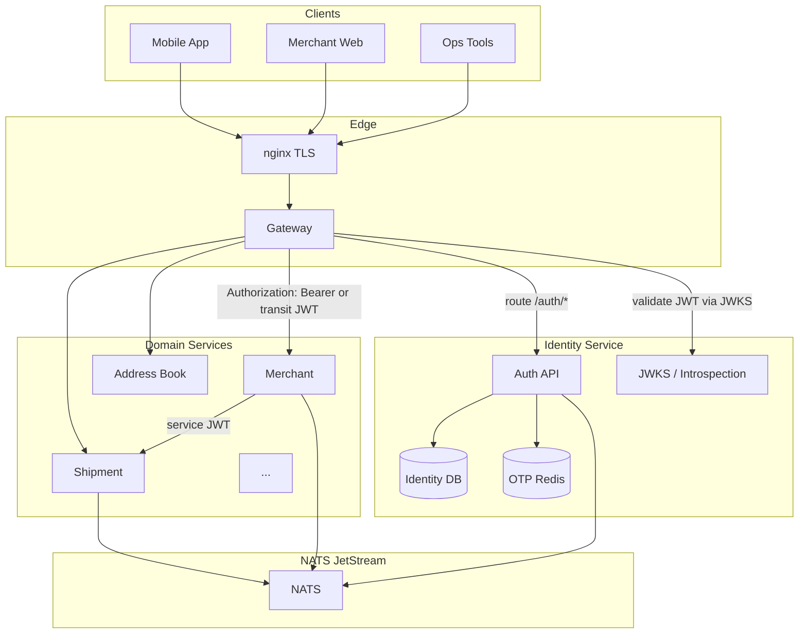

# ADR-0004: Identity Ownership, Gateway Responsibilities, and Service-to-Service Trust

- **Status:** proposed
- **Date:** 2026-08-30
- **Deciders:** (pending — platform architecture review)

Statement classes used throughout: **evidence**, **proposal**, **decision**, **assumption**,
**unresolved policy**. This ADR does not mark any ownership or trust mechanism as accepted.
Implementation of Identity or Gateway services is explicitly out of scope.

---

## Context

The HUDHUD platform extracts bounded contexts from a legacy FastAPI monolith into
independently deployable services. Identity, authorization, and trust boundaries must be
decided before Identity and Gateway can be bootstrapped.

### Platform constraints (binding)

From `architecture/invariants.md` and `architecture/service-boundaries.yaml`:

- Gateway routes, authenticates, and forwards — it does **not** own domain tables or
  business orchestration.
- Service-to-service identity must be explicit; arbitrary forwarded identity headers
  (`X-User-Id`, `X-Role`, and similar) are **not** proof of identity.
- Each service owns its database credentials; cross-service FK and DB access are forbidden.
- Cross-service messaging uses NATS JetStream (at-least-once); event envelopes must carry
  tenant/organization context when applicable.
- One-writer cutover per extracted datastore; bidirectional dual-write is forbidden.

### Legacy evidence baseline

| Field | Value |
|-------|-------|
| Repository | `/Users/mohammadakbari/Development/Projects/Python/hudhud-backend` |
| HEAD SHA | `2e375057fdf9b9ce8416408a4436303be5301def` |
| Pattern | Single monolith, single PostgreSQL 16, in-process auth |
| Platform audits | `docs/audit/legacy-domain-inventory.md`, `docs/audit/legacy-data-ownership-inventory.md` |

**Evidence:** Auth and Identity is **verified** in legacy (`app/modules/auth/`). Customer is
**partial** — no standalone module; profile fields live on `users` while addresses and
notification preferences live in other modules. Gateway does not exist; nginx terminates TLS
only (`deploy/nginx/staging.example.conf`).

### Decision drivers

1. Preserve existing client contracts during staged migration (mobile apps, merchant portal,
   ops tools).
2. Separate authentication identity from domain-owned commercial profiles.
3. Do not collapse all business membership into Identity.
4. Enforce least privilege for service and NATS subject access.
5. Support incident response: session revocation, key rotation, service client disable.
6. Align with peer ADRs on deployables, eventing, and data cutover without re-deciding them.

### Peer ADR dependencies

| ADR | Expected topic | Dependency on this ADR |
|-----|----------------|------------------------|
| ADR-0001 (proposed) | Deployable grouping / transitional topology | Gateway placement and auth termination point |
| ADR-0002 (proposed) | Eventing / NATS topology | Service identities for publish/subscribe; envelope actor context |
| ADR-0006 (proposed) | Data cutover strategy | Identity DB extraction order; credential revocation gates |

**Assumption:** ADR-0001, ADR-0002, and ADR-0006 remain `proposed` at time of writing;
references describe expected coupling only.

---

## Verified Legacy Identity and Data Map

### Authentication and session state (legacy: auth module)

| Asset | Legacy table / store | Writer | Evidence |
|-------|---------------------|--------|----------|
| User credentials | `users` | auth | `app/modules/auth/infrastructure/models.py` |
| Password hash | `users.password_hash` | auth | PBKDF2-SHA256, 600k iterations — `application/passwords.py` |
| OTP challenges | Redis keys `auth:otp:*` | auth | `infrastructure/redis_otp_store.py` |
| Access JWT | HS256, claims `sub`, `type`, `roles`, `permissions`, `sid`, `iat`, `exp` | auth | `application/tokens.py` |
| Refresh tokens | `auth_refresh_tokens` (hashed opaque) | auth | `application/refresh_tokens.py` |
| Sessions | `auth_sessions` | auth | `infrastructure/models.py` L314–350 |
| MFA | `user_mfa_settings`, `user_mfa_recovery_codes` | auth | verified |
| Password reset | `password_reset_tokens` | auth | verified |
| Invitations | `user_invitations` (scope INTERNAL/MERCHANT) | auth | verified |
| Legal acceptance | `user_legal_acceptances` | auth | verified |
| Driver profile | `driver_profiles` | auth | verified |
| Service clients | `service_clients` (`sc_*` + secret hash) | auth | `infrastructure/models.py` L533–557 |

**Evidence:** Access token TTL default 30 minutes; refresh 7 days; OTP 300 seconds —
`app/core/config.py` (names only, no values).

**Evidence:** At request time, `build_current_user_context()` re-loads roles and permissions
from DB; JWT embedded claims are not sole authority — `application/current_user.py`.

### RBAC (legacy: auth module)

| Asset | Legacy table | Count | Evidence |
|-------|-------------|-------|----------|
| Roles | `roles` | 11 role codes | `domain/enums.py`, `app/core/db/auth_rbac_seed.py` |
| Permissions | `permissions` | 107+ codes | `auth_rbac_seed.py` L81–593 |
| User ↔ role | `user_roles` | global assignment | verified |
| Role ↔ permission | `role_permissions` | seed mappings | `ROLE_PERMISSION_CODES` L618–751 |

Role codes include: `SUPER_ADMIN`, `OPERATIONS_ADMIN`, `MERCHANT_*`, `PICKUP_DRIVER`,
`HUB_OPERATOR`, `LINEHAUL_OPERATOR`, `CONTROL_TOWER_OPERATOR`, `CUSTOMER`, `RESELLER`,
`DELIVERY_DRIVER`.

### Scoped membership (legacy: auth + merchant)

| Asset | Legacy table | Scope | Evidence |
|-------|-------------|-------|----------|
| Merchant membership | `merchant_users` | user ↔ merchant | auth models L165–234 |
| Store relationship | `merchant_users.store_relationship` | OWNER, WAREHOUSE_KEEPER | verified |
| Hub access | `user_hub_access` | user ↔ hub | auth models L237–280 |
| Store team invitations | `store_team_invitations` | merchant module | `merchant/infrastructure/store_team_models.py` |
| Store capabilities | derived server-side | not client-trusted | `application/store_capabilities.py` |

**Evidence:** No `organizations` table; `merchants` is the business boundary.

### Domain profiles separated from auth identity (legacy)

| Asset | Owner module | FK to user | Evidence |
|-------|-------------|------------|----------|
| Basic profile fields | auth (`users`) | self | `full_name`, `city`, `preferred_language` |
| Receiver contacts | address_book | `owner_user_id` | `address_book/infrastructure/models.py` |
| Pickup addresses | address_book | `owner_user_id` | verified |
| Notification preferences | notification | `user_id` | `notification/infrastructure/models.py` |
| Merchant business profile | merchant | N/A (separate entity) | `merchants` table |
| Store locations | merchant | via `merchant_id` | verified |

### Service authentication (legacy)

| Mechanism | Header | Format | Evidence |
|-----------|--------|--------|----------|
| Human bearer | `Authorization: Bearer` | JWT access token | `api/dependencies.py` |
| Service API key | `X-API-Key` | `sc_{client_id}.{secret}` | `application/service_client_api_keys.py` |
| Dev actor fallback | `X-Actor-User-ID` | UUID | local/test only when flag enabled |
| Service JWT | — | **missing** | `SERVICE_TOKEN_EXPIRE_MINUTES` config unused |

**Evidence:** No `X-User-Id` or `X-Role` headers in legacy codebase. Production ignores
`ALLOW_ACTOR_HEADER_AUTH_FALLBACK` — `app/core/config.py` L105–110.

### Route-level authorization patterns (legacy)

| Pattern | Purpose | Evidence |
|---------|---------|----------|
| `require_permission(code)` | Global RBAC + audit on deny | `api/authorization.py` |
| `require_merchant_scope()` | Active `merchant_users` or admin override | verified |
| `require_hub_scope(access_type)` | `user_hub_access` row or admin override | verified |
| `require_bearer_permission(code)` | Bearer-only (no actor header) | verified |
| `require_human_or_service_permission(code)` | Bearer or API key, not both | verified |
| Resource guards | Driver/merchant/linehaul ownership | `*_resource_authorization.py` |

Admin override roles: `SUPER_ADMIN`, `OPERATIONS_ADMIN`.

### Edge proxy (legacy)

**Evidence:** nginx (`deploy/nginx/staging.example.conf`) proxies `/api/v1/` to app;
sets `X-Real-IP`, `X-Forwarded-For`, `X-Forwarded-Proto`, `X-Request-ID`. No JWT
validation or identity injection at edge.

---

## Ownership Option Matrix

Each row lists ownership options. **Proposal** marks the recommended default for platform
extraction; final assignment remains unresolved until ADR acceptance.

| Asset | Option A: Identity | Option B: Domain service | Option C: Shared / split | Legacy writer | Proposal |
|-------|-------------------|-------------------------|-------------------------|---------------|----------|
| User credentials (phone, email, password) | Identity owns | — | — | auth | **A** |
| OTP challenges | Identity owns (Redis) | — | — | auth | **A** |
| Refresh sessions | Identity owns | — | — | auth | **A** |
| Access token issuance | Identity owns | Gateway validates only | — | auth | **A + Gateway validates** |
| Global roles | Identity owns | — | — | auth | **A** |
| Global permissions catalog | Identity owns | — | — | auth | **A** |
| Permission assignment (user_roles) | Identity owns | — | — | auth | **A** |
| Organizations | Identity owns | Merchant owns org-like | None (flat merchants) | missing | **B or none** — see unresolved |
| Customer profile (PII on users) | Identity owns | Customer owns profile | Split: Identity auth + Customer profile | auth (partial) | **Split C** — see Customer boundary |
| Addresses | Address Book owns | Customer owns | Identity references user_id only | address_book | **B (address_book)** |
| Merchant business profile | Merchant owns | Identity holds link only | — | merchant | **B** |
| Stores / branches | Merchant owns | — | — | merchant | **B** |
| Merchant membership (`merchant_users`) | Identity owns | Merchant owns | Identity auth + Merchant membership | auth table, merchant flows | **C** — see below |
| Store team invitations | Merchant owns | Identity issues user if new | — | merchant | **B** |
| Hub operator affiliation | Identity owns | Hub owns | Split | auth (`user_hub_access`) | **C** — Identity stores grant; Hub may own ops roster |
| Driver profile | Identity owns | Pickup/Delivery owns | Split | auth | **C** — Identity links user; ops module owns driver facts |
| Finance permissions | Identity catalog | Finance owns scoped grants | — | auth seed | **A catalog + Finance scoped grants** |
| Support/claims permissions | Identity catalog | Support owns ticket scope | — | auth seed | **A catalog + Support scoped grants** |
| Service clients | Identity owns | Per-service clients | Central registry | auth | **A** |
| Legal document acceptance | Identity owns | — | — | auth | **A** |
| MFA settings | Identity owns | — | — | auth | **A** |

### Authentication identity vs domain profiles

**Decision driver:** Legacy conflates login identifier (`phone_number`) and profile fields
(`full_name`, `city`) on `users`. Platform extraction should treat:

- **Authentication identity** — stable `user_id`, credential material, session lifecycle,
  global RBAC assignment, service client registry.
- **Domain profile** — business-owned attributes referenced by `user_id` (merchant legal
  name, store hours, customer marketing prefs, driver vehicle facts).

**Proposal:** Identity is canonical writer for authentication identity. Domain services
own commercial/operational profiles and reference `user_id` by ID only (no cross-service FK).

### Merchant membership ownership options

| Option | Summary | Trade-offs |
|--------|---------|------------|
| **A — Identity owns all membership** | `merchant_users`, hub access, driver links in Identity DB | Simple authorization queries; Identity becomes god-context; merchant module loses autonomy |
| **B — Merchant owns membership** | Merchant service owns `merchant_users`; Identity only authenticates | Clear domain boundary; every merchant-scoped call needs Identity token + Merchant membership fetch |
| **C — Split (recommended proposal)** | Identity owns authentication grants that are security-boundary (hub access, admin roles); Merchant owns commercial membership (`merchant_users`, store team); Gateway/Identity token carries `user_id`; domain services enforce membership via own store | Matches legacy data location today; requires contract for membership queries/events; no automatic "everything in Identity" |

**Proposal:** Option **C**. Identity retains `user_roles`, hub access grants, driver profile
link, and service clients. Merchant service owns `merchants`, store locations, and
`merchant_users` / store team (extracted from auth + merchant modules). Authorization at
Merchant API validates bearer token `sub` + local membership rows.

---

## Proposed Identity Boundary

**Status:** proposal — not accepted.

### Identity service owns (canonical writer)

| Category | Data / behavior |
|----------|-----------------|
| Credentials | Phone, email, password hash, account status |
| OTP | Challenge issuance and verification (Redis or dedicated store) |
| Sessions | Refresh token lifecycle, session revocation |
| Token issuance | Access JWT (or reference token) with `sub`, `sid`, minimal claims |
| Global RBAC | Roles, permissions, `user_roles`, permission catalog seed |
| Security grants | Hub access (`user_hub_access`), driver profile link |
| Service clients | Registration, rotation, revocation, permission binding |
| MFA / invitations / password reset | Full lifecycle |
| Legal acceptance | Terms/privacy acceptance records tied to `user_id` |

### Identity service does NOT own

| Category | Canonical owner |
|----------|-----------------|
| Merchant legal/display profile | Merchant |
| Store locations, categories, products | Merchant |
| Merchant membership rows | Merchant (proposal) |
| Customer addresses | Address Book |
| Notification preferences | Notification |
| Shipment/order/wallet facts | Respective domain services |
| Domain-specific permission enforcement | Each domain service (uses Identity token + local rules) |

### Identity public API (proposal)

- `/auth/otp/*`, `/auth/login`, `/auth/refresh`, `/auth/logout`
- `/auth/me` — authentication identity + global roles (not full merchant/store payload)
- `/auth/admin/*` — user lifecycle (scoped by admin policy)
- `/auth/service-clients/*` — machine credential admin
- JWKS or introspection endpoint for Gateway and services (proposal)

### Identity published events (proposal)

- `identity.user.registered`
- `identity.user.credentials_changed`
- `identity.session.revoked`
- `identity.role.assigned` / `identity.role.revoked`
- `identity.service_client.rotated`

Consumers use idempotent inbox; at-least-once delivery per platform invariant.

---

## Unresolved Customer Boundary

**Classification:** unresolved policy — blocks Customer service bootstrap.

Legacy Customer is **partial**: identity and basic profile live in auth; operational customer
data spans address_book, send_parcel, tracking, support.

| Question | Options | Impact |
|----------|---------|--------|
| Where does "customer profile" live? | (1) Identity keeps all `users` profile fields; (2) Customer service owns profile extension table; (3) Address Book + Notification own prefs, Identity keeps minimum | API shape of `/auth/me` vs `/customers/me` |
| Is Customer a deployable or a facade? | Standalone service vs read API aggregating Identity + Address Book | ADR-0001 deployable count |
| Customer ID vs User ID | Same UUID vs separate customer_id linked to user_id | Migration of existing users |
| Guest / phone-only parcel senders | Identity auto-creates CUSTOMER on OTP (legacy behavior) | Registration policy |
| Legal acceptance ownership | Identity (legacy) vs Customer | Cutover ordering |

**Proposal (interim, not accepted):** Keep authentication identity in Identity; introduce
Customer as optional profile extension service keyed by `user_id`, owning customer-specific
attributes not required for authentication (marketing prefs, segment tags). Address Book
remains separate. `/auth/me` returns identity + role summary; `/customers/me` returns
domain profile when Customer service exists.

**Blocker:** Product must decide whether Customer warrants a dedicated database before
ADR-0001 finalizes deployable grouping.

---

## Gateway Responsibility Matrix

**Status:** proposal — Gateway service not yet implemented.

### Gateway MAY own

| Responsibility | Rationale |
|----------------|-----------|
| HTTP routing to upstream services | Core gateway function |
| Legacy path compatibility | Map `/api/v1/auth/*` → Identity, preserve URLs during migration |
| Authentication enforcement (edge) | Validate JWT/JWKS before upstream; reject unauthenticated where required |
| Rate limiting | Protect Identity OTP and login endpoints |
| Correlation ID | Generate/propagate `X-Request-ID` / `correlation_id` |
| Trace propagation | Inject/propagate `traceparent` (W3C) |
| Request/response normalization | API version headers, error envelope shape |
| Version negotiation | `Accept-Version` or path prefix routing |
| Coarse transport policy | TLS termination, IP allowlists, body size limits, CORS |
| Token passthrough | Forward `Authorization` to upstream when appropriate |

### Gateway MUST NOT own

| Forbidden | Rationale |
|-----------|-----------|
| Business tables | Platform invariant |
| Shipment / finance orchestration | Domain services |
| Domain validation (e.g., COD eligibility) | Belongs in domain service |
| Domain workflows | No business logic in Gateway |
| Cross-service transaction coordination | Use events/commands per ADR-0002 |
| Merchant membership resolution | Merchant service |
| Permission catalog mutation | Identity service |
| Storing refresh tokens | Identity service |

### Gateway trust boundary (proposal)

```
[Client] --TLS--> [Gateway] --mTLS or signed internal JWT--> [Domain Service]
                      |
                      +--> [Identity] (token issue, JWKS, introspection)
```

Gateway validates user access tokens via Identity JWKS (local cache, TTL). Gateway does
**not** mint user permissions from headers. Optional Gateway-issued **internal transit
token** (short-lived, audience-scoped) may wrap validated user context for upstream services
— see Trust Model.

---

## Trust Model

### Design principles (proposal)

1. **No arbitrary forwarded identity headers** — `X-User-Id`, `X-Role` are never proof.
2. **Cryptographic verification** — every hop verifies a signature or mTLS identity.
3. **Actor vs caller** — distinguish end-user (`actor`) from calling service (`caller`).
4. **Least privilege** — service tokens scoped to audience + permissions; NATS subjects restricted.
5. **Revocation** — sessions, service clients, and signing keys support disable without redeploy.

### Token and claim model (proposal)

#### User access token (issued by Identity)

| Claim | Purpose |
|-------|---------|
| `sub` | User UUID |
| `sid` | Session ID (for revocation) |
| `iss`, `aud` | Issuer and intended audience |
| `iat`, `exp` | Short TTL (legacy default 30m; proposal: 15–30m) |
| `type` | `access` |
| `roles` | Optional hint only — **not authoritative** for authorization (legacy reloads from DB) |

**Proposal:** Downstream services treat `sub` and `sid` as authenticated identity proof after
JWKS validation. Role/permission checks query Identity (cached) or enforce locally synced
projection — not JWT claim alone.

#### Gateway internal transit token (optional proposal)

Issued by Gateway after user JWT validation; forwarded to upstream services.

| Claim | Purpose |
|-------|---------|
| `sub` | User UUID (actor) |
| `act` | Actor type: `human` |
| `caller` | `gateway` |
| `aud` | Target service name |
| `correlation_id` | Request correlation |
| `exp` | Very short (e.g., 60s) |

Signed with Gateway key or platform internal CA. Upstream verifies `aud` matches self.

#### Service-to-service token (proposal)

| Claim | Purpose |
|-------|---------|
| `sub` | Service client ID |
| `act` | `service` |
| `permissions` | Scoped permission list |
| `aud` | Target service or `platform-internal` |
| `iat`, `exp` | Short TTL (5–15m) |

**Options evaluated:**

| Mechanism | Summary | Trade-offs |
|-----------|---------|------------|
| Asymmetric signed JWT (RS256/ES256) | Identity or dedicated issuer signs; JWKS per service | Industry standard; rotation via JWKS; proposal **preferred** |
| Legacy API key (`X-API-Key`) | Shared secret per client | Simple migration from legacy; poor rotation; no audience binding |
| Gateway-issued internal claims | Gateway wraps service context | Central control; Gateway becomes SPOF for issuance |
| Direct service-to-service tokens | Caller obtains token from Identity with `aud` | Fine-grained; requires token exchange endpoint |
| mTLS | Client cert per service | Strong transport identity; operational overhead; **future option** |
| NATS credentials / JWT | NATS-native auth | Required for subject-level ACLs; complements HTTP tokens |

**Proposal:** Phase 1 — asymmetric service JWT from Identity (or dedicated Token service
within Identity deployable); JWKS distributed via well-known URL; Gateway and services
cache keys. Legacy `X-API-Key` supported behind Gateway compatibility route during migration
only. Phase 2 — mTLS on internal network where operational cost acceptable.

### Trusted headers — conditions for trust (proposal)

Arbitrary `X-User-Id` / `X-Role` headers are **rejected**.

If an internal header carries identity context (e.g., `X-Internal-Identity` JSON), it is
trustworthy **only when all** of:

1. Request arrives on mTLS-authenticated internal network **or** carries valid Gateway
   transit JWT in `Authorization`.
2. Header is set by Gateway (strip inbound client copies at edge).
3. Payload is signed (JWT) or HMAC-sealed with rotating key.
4. Service verifies `aud`, `exp`, and issuer allowlist.

Legacy `X-Actor-User-ID` is **not** migrated to production; dev/test only.

### User JWT vs service identity

| Principal | Token source | Typical use |
|-----------|-------------|-------------|
| Human user | Identity access JWT | Mobile, web, ops tools via Gateway |
| Service client | Identity service JWT or API key (transitional) | Batch jobs, internal automation |
| Gateway | Gateway service identity | Health, routing, token exchange |

Services must distinguish `AuthPrincipal` human vs service (legacy pattern:
`CurrentUserContext | ServiceClientContext`).

### Tenant / organization context propagation

Legacy has no organization layer; `merchant_id` scopes merchant context.

**Proposal:** Event envelope and internal tokens carry optional:

- `tenant_id` — reserved for future multi-tenant (nullable)
- `merchant_id` — when request is merchant-scoped (set by Merchant middleware, not client header)
- `hub_id` — when hub-scoped

Gateway does not invent merchant scope; upstream Merchant or Identity membership APIs enforce.

### Revocation and incident response (proposal)

| Asset | Revocation mechanism |
|-------|---------------------|
| User session | Identity marks `auth_sessions.revoked_at`; reject refresh; optional session denylist cache |
| Access token | Short TTL + optional `sid` denylist until expiry |
| Service client | Identity disables client; JWKS unaffected; client_id blocklist |
| Signing key | JWKS rotation with overlap window; `kid` header |
| Compromised Gateway key | Rotate Gateway signing key; invalidate transit tokens (60s max exposure) |

Audit: all revocation events append to Identity audit stream and security SIEM fields.

---

## NATS Authorization Implications (proposal)

Per ADR-0002 (eventing), cross-service messaging uses NATS JetStream.

| Concern | Proposal |
|---------|----------|
| Connection identity | Each service has NATS credential (JWT or NKey) issued per deployable |
| Subject permissions | Publish/subscribe allowlists per service identity (e.g., Shipment publishes `shipment.lifecycle.changed`) |
| User context in events | Event envelope carries `actor_user_id`, `correlation_id`, `traceparent` — not NATS login identity |
| Service origin | Envelope `producer` field matches NATS service identity |
| Compromise | Disable NATS credential independently of HTTP service JWT |

Identity service NATS role: publish identity lifecycle events; no shipment/finance subjects.

---

## Compatibility and Migration

### Preserve client contracts (proposal)

| Legacy contract | Platform approach |
|-----------------|-------------------|
| `/api/v1/auth/*` paths | Gateway routes to Identity; same paths initially |
| JWT shape (`sub`, `roles`, `permissions`, `sid`) | Identity preserves claim names; add `iss`, `aud` |
| Refresh flow | Same endpoints; Identity owns session store |
| `X-API-Key` service auth | Transitional compatibility route; deprecate with timeline |
| `/auth/me` merchant context | Split: minimal in Identity; merchant context from Merchant API (versioned response change — **unresolved policy**) |

### Staged token migration

1. **Stage 0:** Gateway proxies to legacy monolith (if needed during parallel run).
2. **Stage 1:** Identity issues tokens; Gateway validates via shared secret then JWKS.
3. **Stage 2:** Services reject legacy HS256 without `iss`; accept RS256 JWKS only.
4. **Stage 3:** Retire `X-API-Key` except break-glass; service JWT mandatory.

### Stable identifiers

- `user_id` (UUID) remains stable across cutover — **proposal**.
- `merchant_id`, `store_location_id` unchanged — owned by Merchant.
- Service client `client_id` prefix `sc_` preserved for audit continuity.

### Legacy and new service coexistence

- Gateway path-based routing sends auth traffic to Identity; other paths to legacy or new services.
- Dual validation period: Gateway accepts both legacy HS256 (monolith) and Identity RS256 during cutover.
- One-writer cutover for Identity DB: legacy auth tables migrate to Identity database; legacy monolith auth disabled after credential revocation gate (ADR-0006).

### Deprecation / versioning

- API version header `X-API-Version` or path `/api/v2/` for breaking `/me` shape changes.
- Authorization auditability: log `sub`, `caller`, permission checked, resource, decision, `correlation_id`.

---

## Security Threats and Mitigations

| Threat | Mitigation (proposal) |
|--------|----------------------|
| Forged identity headers | Strip client headers at Gateway; cryptographic tokens only |
| Stolen access token | Short TTL, session revocation, optional step-up for sensitive ops |
| Refresh token reuse | Rotation + reuse detection (legacy pattern retained) |
| Service API key leak | Migrate to short-lived service JWT; rotation; per-client permissions |
| JWT algorithm confusion | Allowlist algorithms; JWKS only RS256/ES256 in production |
| Gateway bypass | Network policy: services not public; accept only Gateway mTLS/internal JWT |
| Privilege escalation via JWT claims | Services reload permissions from Identity or synced projection |
| OTP brute force | Rate limits at Gateway + Identity; lockout (legacy Redis lock keys) |
| Insider service impersonation | Service tokens include `sub` of service, not user; user context only via validated user token |
| NATS subject spoofing | NATS ACLs per service identity |

---

## Observability and Audit Requirements (proposal)

| Signal | Requirement |
|--------|-------------|
| Auth events | Login success/fail, OTP request, refresh, logout, MFA challenge |
| Authorization denials | Permission, scope, membership — with `sub`, resource, reason |
| Service auth | Service client ID, permission, endpoint |
| Correlation | `correlation_id` from Gateway through all services |
| Tracing | W3C `traceparent` on HTTP and in event envelope |
| Metrics | Token validation latency, JWKS fetch errors, OTP rate, session count |
| Audit retention | Identity audit logs immutable append; align with Audit bounded context policy |

No secret values in logs (tokens, API keys, OTP codes).

---

## Rollout and Rollback (proposal)

### Rollout

1. Bootstrap Identity service with legacy schema extract (ADR-0006 cutover plan).
2. Deploy Gateway with pass-through to legacy; no auth change.
3. Enable Gateway JWT validation against Identity JWKS (shadow mode logging only).
4. Enforce validation; route `/api/v1/auth/*` to Identity.
5. Enable service JWT for first internal caller (e.g., Notification).
6. Migrate merchant membership data to Merchant DB if Option C accepted.
7. Revoke legacy auth DB credentials (cutover gate).

### Rollback

| Stage | Rollback action |
|-------|-----------------|
| Shadow validation | Disable enforcement flag |
| Identity routing | Gateway route auth back to legacy monolith |
| JWKS rotation failure | Revert to previous `kid` in JWKS endpoint |
| Membership split | Identity remains source of truth until Merchant verified |

Irreversible: user password hashes and session data migrated with one-writer cutover — rollback
requires restore from backup, not dual-write.

---

## Options (Summary)

| Option | Identity scope | Gateway auth | Service trust | Customer |
|--------|---------------|--------------|---------------|----------|
| **1 — Minimal Identity** | Auth only; all membership in domains | Validates JWT | mTLS only | Separate service |
| **2 — Fat Identity** | Auth + all membership + profiles | Full authZ | API keys | Merged into Identity |
| **3 — Recommended proposal** | Auth + security grants; domains own commercial data | Validates + optional transit JWT | Asymmetric JWT + NATS creds | Unresolved split profile |

---

## Decision Drivers (ranked)

1. Security — no header trust; explicit service identity (platform invariant).
2. Migration risk — preserve client auth contracts and stable UUIDs.
3. Domain boundary clarity — Merchant owns merchant membership (proposal).
4. Operational cost — JWKS caching vs mTLS everywhere.
5. Team size — Identity as one deployable initially (pending ADR-0001).
6. Auditability — authorization decisions logged with correlation.

---

## Decision

**Status: proposed — no binding decision.**

**Proposed recommendation (requires named deciders to accept):**

1. **Identity** is canonical writer for authentication identity, sessions, global RBAC,
   service clients, hub access grants, driver profile links, and legal acceptance.
2. **Merchant** owns merchants, stores, and merchant membership (extracted from legacy
   `merchant_users` + store team).
3. **Address Book** owns addresses; **Notification** owns notification preferences.
4. **Customer** boundary remains **unresolved** — profile extension service vs Identity-held
   fields must be decided before Customer bootstrap.
5. **Gateway** validates tokens, routes legacy paths, applies rate limits and tracing; does
   not own business tables or domain authorization logic.
6. **Service trust** uses asymmetric JWT with JWKS, short TTLs, NATS credentials for
   subject ACLs; legacy API keys transitional only; no production trusted identity headers.
7. **Authorization** — services verify `sub` cryptographically; permission checks use Identity
   API or synced projection, not client-supplied roles.

---

## Consequences

### Positive

- Clear separation of authentication from commercial domain data.
- Aligns with platform invariants (Gateway without business orchestration).
- Supports independent Identity scaling and key rotation.
- Legacy migration path preserves mobile/client auth flows.

### Negative

- Merchant-scoped requests may require membership lookup beyond token validation.
- `/auth/me` response split may break clients unless versioned carefully.
- JWKS infrastructure and NATS credential management add operational surface.
- Customer boundary delay blocks some extraction workstreams.

### Neutral

- Identity database remains dedicated per service-boundaries direction.
- Eventing identity context depends on ADR-0002 envelope spec.
- Deployable count for Identity vs Gateway coupling depends on ADR-0001.

---

## Migration Impact

- Extract legacy auth tables to Identity dedicated database (one-writer cutover per ADR-0006).
- Migrate `merchant_users` to Merchant database if Option C accepted — requires data migration
  script and FK removal from Identity.
- Gateway becomes new entry point; nginx may remain TLS edge in front of Gateway.
- Redis OTP namespace moves to Identity infrastructure.
- JWT signing key: migrate from HS256 shared secret to RS256 with JWKS (staged).
- Service clients table moves to Identity; callers update to service JWT over time.
- Credential revocation on legacy auth DB is mandatory cutover gate.

Bidirectional dual-write is forbidden.

---

## Observability

See **Observability and Audit Requirements** above. Gateway emits access logs with route,
status, latency, `correlation_id`. Identity emits auth metrics and structured audit events.

---

## Security

See **Security Threats and Mitigations** and **Trust Model** above. Least privilege for
service clients and NATS subjects. No secrets in source or logs. Database credentials scoped
to Identity DB only.

---

## Rollback

See **Rollout and Rollback** above. Forward-fix preferred for JWKS rotation failures;
Identity DB restore from backup is last resort after cutover.

---

## Unresolved Questions

1. **Customer boundary** — standalone Customer service vs profile fields remaining in Identity?
2. **Organization model** — introduce `organizations` above merchants or keep flat `merchant_id`?
3. **`/auth/me` contract** — single aggregated response vs split across Identity + Merchant APIs?
4. **Permission authority** — synchronous Identity introspection vs per-service permission projection cache TTL?
5. **Hub access ownership** — Identity-only vs Hub service owning operator roster?
6. **Driver profile** — Identity-only vs Pickup/Delivery split?
7. **Gateway ↔ Identity deployable** — separate containers vs combined process (ADR-0001)?
8. **Transit JWT** — required or services accept user JWT directly from Gateway passthrough?
9. **mTLS timeline** — phase 1 or deferred?
10. **Legacy HS256 coexistence duration** during parallel run?
11. **Finance and Support scoped permissions** — separate grant tables or RBAC codes only?
12. **Guest checkout / phone-only users** — retain legacy auto-create CUSTOMER on OTP?

---

## Alternatives Considered

| Alternative | Why rejected (for proposal) |
|-------------|----------------------------|
| Fat Identity (all membership in Identity) | Violates domain boundary goal; Merchant loses autonomy |
| Trust `X-User-Id` on internal network | Contradicts platform invariant; no cryptographic proof |
| API keys only for services | Legacy-compatible but weak rotation and audience binding |
| Gateway performs RBAC | Blurs Gateway/domain boundary; duplicates Identity |
| Shared auth library with shared ORM | Forbidden by platform invariant (no shared ORM) |
| Keep auth in legacy monolith indefinitely | Blocks independent Identity scaling and cutover |

---

## References

### Related ADRs

- ADR-0001 (proposed) — deployable grouping and transitional topology
- ADR-0002 (proposed) — eventing, NATS JetStream, event envelope
- ADR-0006 (proposed) — database extraction and one-writer cutover

### Legacy evidence

- Legacy HEAD: `2e375057fdf9b9ce8416408a4436303be5301def`
- `app/modules/auth/infrastructure/models.py` — users, sessions, RBAC, service clients
- `app/modules/auth/application/tokens.py` — JWT claims
- `app/modules/auth/api/dependencies.py` — bearer, API key, actor header
- `app/modules/auth/api/authorization.py` — permission dependencies
- `app/core/db/auth_rbac_seed.py` — roles and permissions seed
- `app/modules/merchant/infrastructure/store_team_models.py` — store team
- `deploy/nginx/staging.example.conf` — edge proxy behavior
- Platform: `docs/audit/legacy-domain-inventory.md`
- Platform: `docs/audit/legacy-data-ownership-inventory.md`

### Platform invariants

- `architecture/invariants.md`
- `architecture/service-boundaries.yaml`
- `architecture/ownership-matrix.yaml`

---

## Appendix: Trust-Boundary Diagram



---

## Appendix: Legacy-to-Platform Ownership Mapping

| Legacy location | Platform proposal |
|-----------------|-------------------|
| `users`, sessions, OTP, MFA | Identity |
| `roles`, `permissions`, `user_roles` | Identity |
| `merchant_users` | Merchant (proposal) |
| `user_hub_access` | Identity (proposal) |
| `driver_profiles` | Identity link; ops facts in Pickup/Delivery (unresolved) |
| `merchants`, stores, store team | Merchant |
| `pickup_addresses`, `receiver_contacts` | Address Book |
| `notification_preferences` | Notification |
| `service_clients` | Identity |
| Customer profile fields on `users` | **Unresolved** — Identity or Customer |
