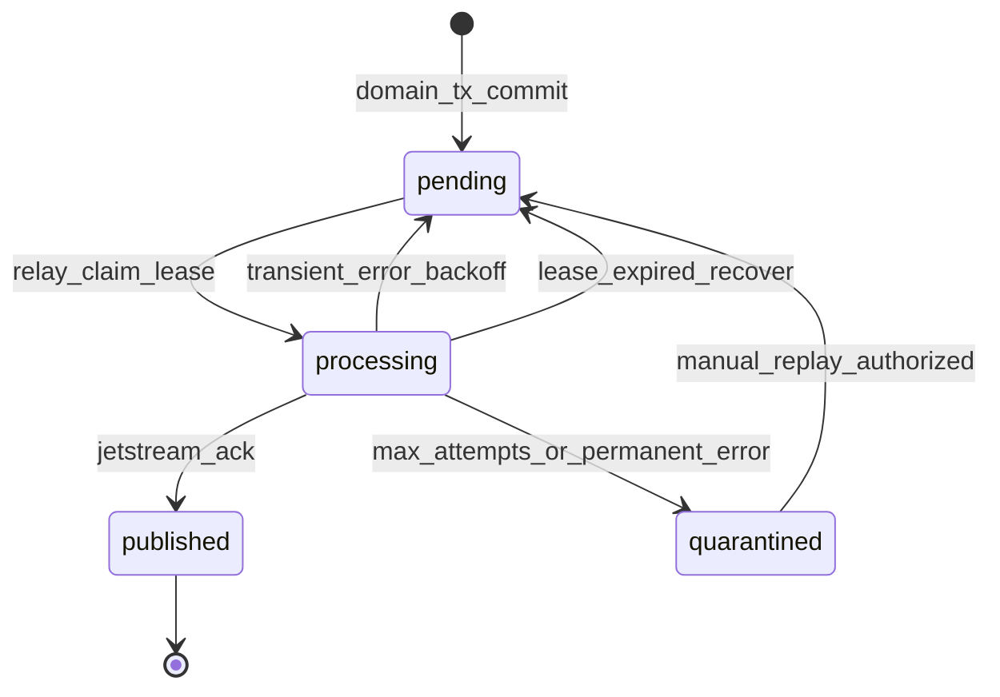
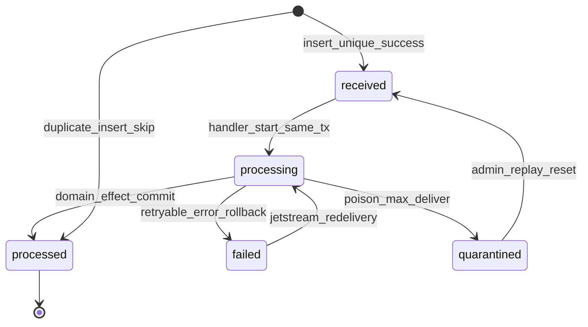

# ADR-0008: Service-Owned Outbox/Inbox Persistence and Processing

- **Status:** Proposed
- **Date:** 2026-08-30
- **Deciders:** (pending — platform architecture review)
- **Workstream:** W3-D
- **Implementation allowed:** no — persistence strategy and processing semantics only; schema bootstrap blocked until acceptance and implementation gates

Label key: **[evidence]** verified from repository, legacy audit, or accepted ADR; **[proposal]** recommended design not yet accepted; **[decision]** binding only after acceptance; **[assumption]** engineering default pending validation; **[unresolved policy]** requires named deciders.

---

## Context

### Problem statement

**[evidence]** ADR-0002 (Accepted) defines cross-service messaging semantics — versioned JSON envelope, per-service transactional outbox, durable idempotent inbox, NATS JetStream topology, at-least-once delivery, lease-based relay, and poison quarantine — but does **not** decide **how each service implements persistence and processing code** without violating platform invariants.

**[evidence]** Platform invariants (`architecture/invariants.md` §Service Independence, §Shared Packages) forbid:

- Cross-service Python imports of another service's package
- Shared ORM models and Alembic migrations
- Generic repository frameworks and "common business logic" packages
- Cross-service database sessions or credentials

**[evidence]** Each deployable service owns its composition root, database credentials, schema migrations, outbox/inbox, tests, deployment, observability, and backup/restore (`architecture/invariants.md` §Repository vs Runtime; `AGENTS.md`).

**[evidence]** `packages/event_envelope` already provides envelope types, serialization, and validation only — explicitly **not** outbox/inbox persistence (`packages/event_envelope/README.md`).

**[evidence]** Legacy (`hudhud-backend` @ `2e375057fdf9b9ce8416408a4436303be5301def`) implements a **notification push outbox** with lease claim (`FOR UPDATE SKIP LOCKED`), stale lease recovery, per-row commit, and retry scheduling (`notification/infrastructure/push_outbox_repositories.py`, `notification/application/push_outbox_worker.py`). This validates operational patterns but is **not** a general integration outbox (`docs/adr/0007-legacy-event-bridge-strategy.md`).

**[evidence]** NATS JetStream foundation topology is scaffolded under `infra/eventing/topology/` (streams, durable consumer templates) per ADR-0002; no service-level outbox/inbox tables or relay workers exist in `services/` (F0).

The decision question is:

> **How should each HUDHUD service own outbox/inbox persistence and relay/consumer processing while sharing only allowlisted technical primitives, preserving independent migrations, and meeting ADR-0002 processing semantics?**

This ADR evaluates implementation packaging options, defines proposed algorithms and failure matrices, and specifies conformance expectations. It does **not** implement schemas, migrations, packages, or workers.

### Binding constraints (already decided — not re-litigated)

| Constraint | Source |
|------------|--------|
| At-least-once JetStream; no exactly-once transport claims | ADR-0002, `architecture/invariants.md` |
| Same-transaction domain write + outbox insert | ADR-0002 |
| Inbox deduplication on `(consumer_name, event_id)` | ADR-0002 |
| Per-service database ownership and credentials | `architecture/invariants.md`, ADR-0006 |
| No shared ORM or cross-service repositories | `architecture/invariants.md`, `service-boundaries.yaml` |
| Envelope field set and `event_id` stability | ADR-0002, `packages/event_envelope` |
| Legacy bridge is transitional; native outbox is target | ADR-0007 |

### Peer ADR dependencies

| ADR | Relevance |
|-----|-----------|
| ADR-0002 | Envelope, JetStream topology, high-level outbox/inbox semantics |
| ADR-0003 | Aggregate ordering, reconciliation for out-of-order lifecycle facts |
| ADR-0004 | Service identity for replay authorization; NATS credentials |
| ADR-0006 | Cutover timing — outbox/inbox tables migrate with owning service DB |
| ADR-0007 | Bridge relay differs from native outbox; retirement criteria |

---

## Options

### O1 — Shared ORM models and migrations across services

| Summary | Trade-offs |
|---------|------------|
| Single `packages/integration_persistence` with SQLAlchemy models, Alembic base, and shared repository classes imported by all services. | **Pros:** One implementation; uniform schema. **Cons:** **Violates** `architecture/invariants.md` §No shared ORM; couples service deploy cycles; forbidden category in `shared_packages.forbidden_categories`; central macro abstraction. **Verdict:** **Rejected.** |

### O2 — Copied per-service implementation (no shared code)

| Summary | Trade-offs |
|---------|------------|
| Each service copy-pastes outbox/inbox ORM, relay loop, and inbox handler from an internal template or prior service. | **Pros:** Maximum isolation; no shared-package governance. **Cons:** Semantic drift (lease duration, status enums, poison handling); duplicated bug fixes; architecture tests cannot enforce one behavior; high review burden per bootstrap. **Verdict:** **Rejected as primary strategy** — acceptable only as accidental starting point before conformance kit exists. |

### O3 — Shared technical persistence library (ORM + relay runtime)

| Summary | Trade-offs |
|---------|------------|
| Allowlisted package exporting SQLAlchemy table definitions, generic `OutboxRelay`, `InboxWorker`, and repository base classes services subclass minimally. | **Pros:** DRY; single place for algorithm fixes. **Cons:** Effectively **shared ORM** and **generic repository framework** — both **forbidden** (`service-boundaries.yaml` `forbidden_categories`); tempts hidden business coupling; one package version pins all services; violates "technical packages cannot own business persistence." **Verdict:** **Rejected.** |

### O4 — Service-owned schema/adapters + shared protocol/conformance kit (recommended)

| Summary | Trade-offs |
|---------|------------|
| Each service owns Alembic migrations and SQLAlchemy (or raw SQL) adapters implementing **ports** defined in a narrow allowlisted package. Shared kit provides: state/status enums, port protocols, reference SQL snippets (documentation), multi-replica algorithm spec, and **conformance test vectors** — no importable ORM models. | **Pros:** Honors per-service schema ownership; independent migration heads; shared **behavioral** contract without shared tables; architecture tests can run conformance suite against each service's adapters; aligns with `event_envelope` precedent. **Cons:** Some duplication of adapter glue; requires discipline to update kit when semantics change. **Verdict:** **Proposed recommendation.** |

### O5 — Generated templates with service-owned migrations

| Summary | Trade-offs |
|---------|------------|
| Codegen or skill (`bootstrap-service`) emits service-local adapter skeletons, relay/inbox worker wiring, and **empty** Alembic revision stubs from ADR-0008 record shapes; developer fills domain coupling. | **Pros:** Reduces bootstrap errors; migrations remain in service tree; not a runtime shared framework. **Cons:** Generated code can stale; still needs O4 conformance kit; codegen maintenance cost. **Verdict:** **Proposed complementary accelerator** under O4 — not a substitute for owned adapters. |

---

## Comparative option matrix

Scores: **Low** / **Med** / **High** (qualitative — **[proposal]**, not measured).

| Criterion | O1 Shared ORM | O2 Copy-paste | O3 Shared persistence lib | O4 Protocol + conformance | O5 Codegen templates |
|-----------|---------------|---------------|---------------------------|---------------------------|----------------------|
| Invariant compliance | **Low** | **High** | **Low** | **High** | **High** (if O4-bound) |
| Independent migrations | **Low** | **High** | **Med** | **High** | **High** |
| Behavioral consistency | **High** | **Low** | **High** | **Med–High** | **Med** |
| Drift / fork risk | **Low** | **High** | **Med** | **Med** | **Med** |
| Bootstrap effort | **High** (central) | **Low** initial | **Med** | **Med** | **Low** initial |
| Operational fix propagation | **High** | **Low** | **High** | **Med** (kit + tests) | **Med** |
| Forbidden shared ORM | Violates | OK | Violates | OK | OK |
| Business persistence in `packages/` | Violates | OK | Violates | OK (ports only) | OK |
| Conformance enforceability | **Med** | **Low** | **Med** | **High** | **Med** |

---

## Decision drivers

1. **[evidence]** No shared ORM, no generic repository frameworks, no Alembic in `packages/` (`architecture/invariants.md`, `service-boundaries.yaml`).
2. **[evidence]** Each service owns migrations, credentials, and outbox/inbox runtime (`architecture/invariants.md`).
3. **[evidence]** ADR-0002 Accepted semantics must hold identically on every service — lease relay, inbox dedupe, poison path — without a central macro service.
4. **[proposal]** Legacy push outbox proves PostgreSQL `SKIP LOCKED` claim pattern works in this codebase (`push_outbox_repositories.py` L121–136).
5. **[proposal]** `event_envelope` establishes precedent for allowlisted technical-only shared packages.
6. **[proposal]** Multi-replica safety and crash matrices must be testable before production traffic.
7. **[unresolved policy]** Default relay placement (embedded vs sidecar) remains ADR-0002 open question — this ADR defines algorithm either way.

---

## Decision

**[proposal]** Adopt **Option O4** as the platform persistence and processing strategy, with **Option O5** as the approved bootstrap accelerator once O4 is accepted.

**Per service:**

1. **Own** PostgreSQL tables `integration_outbox` and `integration_inbox` (names provisional — service may prefix, e.g. `pickup_integration_outbox`, but column semantics MUST conform).
2. **Own** Alembic migrations creating and evolving those tables.
3. **Implement** port interfaces (outbox writer, relay claimer, inbox recorder, inbox handler orchestrator) in the service infrastructure layer — SQLAlchemy allowed **inside the service only**.
4. **Depend on** allowlisted shared packages for envelope (`event_envelope`) and, after acceptance, a new **`messaging_conformance`** (name provisional) package providing protocols, status enums, algorithm constants, and pytest fixtures — **not** ORM models.

**Explicitly rejected:** O1, O3; O2 as sustained strategy.

**Status: Proposed.** Acceptance requires named deciders and implementation gate clearance below.

---

## Acknowledgement taxonomy

Four distinct acknowledgement layers MUST NOT be conflated:

| Layer | Mechanism | Meaning | Failure if confused |
|-------|-----------|---------|---------------------|
| **JetStream ACK** | `msg.ack()` / `nak()` on pull consumer | Broker stops redelivery for this delivery attempt | Duplicate handler runs if ACKed before durable inbox insert |
| **Inbox acknowledgement** | Row reaches terminal inbox status (`processed` or `quarantined`) | Service recorded idempotent consumption decision | Reprocessing or skipped poison handling |
| **Business-effect commit** | Domain/projection transaction commit | Owned mutable state reflects handler outcome | Data corruption or lost side effects |
| **DLQ/quarantine** | Inbox `quarantined` + optional publish to `hudhud.dlq.{consumer}` | Poison isolated; JetStream ACK stops infinite retry | Stream blockage or silent drop |

**[proposal]** Correct ordering for consumers:

1. Pull message (JetStream pending).
2. Insert inbox row (unique `(consumer_name, event_id)`) — **single DB transaction start**.
3. If duplicate → JetStream **ACK** immediately (inbox already decided).
4. Run handler; commit domain/projection in **same transaction** as inbox status → `processed`.
5. Commit → JetStream **ACK**.
6. On poison → mark inbox `quarantined`, publish DLQ envelope, JetStream **ACK**.

**Replay authorization** is a **separate administrative action** (operator/service credential per ADR-0004) — not implied by JetStream ACK or inbox `processed`.

---

## Proposed technical record shapes

Column types are logical — **no ORM code**. Services map to PostgreSQL types in owned migrations.

### `integration_outbox` (per publishing service)

| Column | Type | Constraints | Notes |
|--------|------|-------------|-------|
| `id` | UUID | PK | Row identifier |
| `event_id` | UUID | UNIQUE NOT NULL | Stable envelope `event_id`; immutable after insert |
| `subject` | VARCHAR(256) | NOT NULL | JetStream subject (ADR-0002 S2 pattern) |
| `payload_json` | JSONB | NOT NULL | Full serialized envelope |
| `status` | VARCHAR(32) | NOT NULL | See outbox state machine |
| `attempt_count` | INTEGER | NOT NULL DEFAULT 0 | Relay publish attempts |
| `max_attempts` | INTEGER | NOT NULL DEFAULT 5 | **[assumption]** match ADR-0002 provisional default |
| `next_attempt_at` | TIMESTAMPTZ | NOT NULL | Scheduler for pending/retry |
| `processing_owner` | VARCHAR(128) | NULL | Relay instance id (hostname+pid or k8s pod uid) |
| `processing_until` | TIMESTAMPTZ | NULL | Lease expiry |
| `published_at` | TIMESTAMPTZ | NULL | Set only after JetStream publish ACK |
| `last_error_code` | VARCHAR(64) | NULL | Sanitized classifier |
| `last_error_message` | TEXT | NULL | Sanitized — no secrets/PII |
| `created_at` | TIMESTAMPTZ | NOT NULL | Insert time |

**Indexes (proposal):**

- `(status, next_attempt_at)` WHERE `status IN ('pending', 'processing')` — relay poll
- UNIQUE `(event_id)`

**Invariants:**

- `event_id` assigned at domain transaction time (UUID v4 or ULID — **[assumption]** UUID v4 to match envelope package).
- `payload_json` MUST validate against `event_envelope` before insert.
- No update to `event_id` or envelope identity fields after commit.

### `integration_inbox` (per consuming service)

| Column | Type | Constraints | Notes |
|--------|------|-------------|-------|
| `id` | UUID | PK | |
| `consumer_name` | VARCHAR(128) | NOT NULL | Durable identity (ADR-0002 D4) |
| `event_id` | UUID | NOT NULL | Envelope `event_id` |
| `event_type` | VARCHAR(128) | NOT NULL | Denormalized query |
| `aggregate_type` | VARCHAR(64) | NULL | |
| `aggregate_id` | UUID | NULL | |
| `aggregate_version` | INTEGER | NULL | For ordering/gap detection |
| `status` | VARCHAR(32) | NOT NULL | See inbox state machine |
| `received_at` | TIMESTAMPTZ | NOT NULL | First insert |
| `processing_started_at` | TIMESTAMPTZ | NULL | |
| `processed_at` | TIMESTAMPTZ | NULL | Terminal success |
| `handler_version` | VARCHAR(64) | NULL | Deploy/git sha for audit |
| `attempt_count` | INTEGER | NOT NULL DEFAULT 0 | Handler attempts (incl. redeliveries) |
| `last_error_code` | VARCHAR(64) | NULL | Sanitized |
| `last_error_message` | TEXT | NULL | Sanitized |
| `payload_json` | JSONB | NULL | Optional copy for offline replay |
| `jetstream_stream` | VARCHAR(128) | NULL | Source stream |
| `jetstream_seq` | BIGINT | NULL | Optional broker sequence audit |
| `correlation_id` | UUID | NULL | Denormalized from envelope |

**Constraints:**

- UNIQUE `(consumer_name, event_id)` — idempotency gate

**Indexes (proposal):**

- `(consumer_name, status)` — admin replay queries
- `(aggregate_type, aggregate_id, aggregate_version)` WHERE `status = 'processed'` — gap scans

### Optional `integration_inbox_quarantine_audit` (per service)

| Column | Type | Notes |
|--------|------|-------|
| `id` | UUID | PK |
| `inbox_id` | UUID | FK to inbox row |
| `quarantined_at` | TIMESTAMPTZ | |
| `operator_principal` | VARCHAR(128) | Service or human id |
| `reason` | TEXT | Ticket/reference |
| `replay_authorized_at` | TIMESTAMPTZ | NULL until approved |
| `replay_event_id` | UUID | NULL — new id if republished as new message |

**[proposal]** Long-term legal/ops audit retention for quarantine actions belongs to the **Audit** bounded context (ADR-0002) — this table is operational evidence within the consumer service.

---

## Outbox state machine



| Status | Meaning |
|--------|---------|
| `pending` | Committed; awaiting relay claim |
| `processing` | Leased by a relay replica |
| `published` | JetStream publish ACK received |
| `quarantined` | Terminal failure; requires operator replay or discard policy |
| `failed` | **[optional]** Alias avoided — use `pending` with backoff or `quarantined` to reduce states |

---

## Inbox state machine



**Duplicate path:** second delivery attempts insert → conflict → treat as `processed` for JetStream ACK purposes without re-running handler.

---

## Outbox processing algorithm

### 1. Domain write (producer API / use case)

**[proposal]** Pseudocode semantics:

```
BEGIN TRANSACTION
  apply_domain_mutation()
  validate envelope = build_envelope(event_id=NEW_UUID, ...)
  INSERT integration_outbox (event_id, subject, payload_json, status='pending', next_attempt_at=now(), ...)
COMMIT
```

- Rollback → no outbox row → no external publication.
- `event_id` generated **once** inside transaction; reused in envelope and outbox row.

### 2. Relay loop (per service, multi-replica safe)

Each relay replica runs:

```
loop until shutdown:
  RECOVER stale processing rows
  CLAIM batch
  COMMIT claim transaction
  for each claimed row:
    try publish + mark published in separate transaction per row
```

**RECOVER (step A):**

```sql
UPDATE integration_outbox
SET status = 'pending',
    processing_owner = NULL,
    processing_until = NULL,
    next_attempt_at = now(),
    last_error_code = 'STALE_LEASE'
WHERE status = 'processing'
  AND processing_until < now();
```

**CLAIM (step B) — `[evidence]` legacy uses `FOR UPDATE SKIP LOCKED`:**

```sql
-- Subquery selects candidate ids with SKIP LOCKED, ordered by next_attempt_at
UPDATE integration_outbox
SET status = 'processing',
    processing_owner = :owner,
    processing_until = now() + :lease_interval,
    attempt_count = attempt_count + 1
WHERE id IN (SELECT id FROM ... FOR UPDATE SKIP LOCKED LIMIT :batch_size)
RETURNING *;
```

**COMMIT** claim before publish so other replicas see leases.

**PUBLISH (step C) per row:**

1. Deserialize `payload_json`; reject if over size limit (ADR-0002 256 KiB hard limit).
2. `jetstream.publish(subject, payload, headers={'Nats-Msg-Id': event_id})`.
3. On broker ACK → `UPDATE status='published', published_at=now(), processing_owner=NULL`.
4. On transient error → `status='pending'`, schedule `next_attempt_at` with exponential backoff `[5s, 30s, 2m, 10m, 30m]` **[assumption]** ADR-0002 defaults.
5. On permanent error or `attempt_count >= max_attempts` → `status='quarantined'`; optional copy to `hudhud.dlq.{producer}`.

### 3. Multi-replica relay algorithm

| Mechanism | Purpose |
|-----------|---------|
| `FOR UPDATE SKIP LOCKED` on claim | Prevents double-claim across replicas |
| `processing_owner` + `processing_until` | Lease visibility |
| Recover stale `processing` | Crash mid-batch recovery |
| Per-row commit after publish | At-least-once publish — crash after ACK marks published; crash before ACK retries publish (JetStream `Nats-Msg-Id` dedup window 2m **[assumption]**) |

**[proposal]** At-least-once end-to-end: duplicate publish possible if ACK lost after DB commit failure; JetStream dedup window plus consumer inbox dedupe makes system safe.

### 4. Alternatives to `SKIP LOCKED` (evaluated)

| Alternative | Verdict |
|-------------|---------|
| Advisory locks per `event_id` | **[proposal]** Reject — higher complexity; no ordering benefit |
| `SELECT … FOR UPDATE` without SKIP LOCKED | **[proposal]** Reject — replica contention blocks relay |
| External leader election (Redis/etcd) | **[proposal]** Defer — extra infra on 16 GB host; lease columns sufficient |
| Single relay replica only | **[proposal]** Reject for prod — SPOF; acceptable in dev Compose profile |
| PostgreSQL `LISTEN/NOTIFY` wake-up | **[proposal]** Optional optimization — polling remains source of truth |

**[proposal]** **`FOR UPDATE SKIP LOCKED`** is the recommended claim mechanism — validated by legacy push outbox.

---

## Outbox failure matrix

| # | Scenario | Outbox row state after | JetStream | External visibility | Recovery |
|---|----------|------------------------|-----------|---------------------|----------|
| O1 | Crash before domain COMMIT | none | none | none | Client retry |
| O2 | Crash after COMMIT, before relay | `pending` | none | none | Relay picks up |
| O3 | Crash after claim COMMIT, before publish | `processing` | none | none | Lease recover → `pending` |
| O4 | Crash after publish ACK, before DB update | `processing` | message exists | consumers may process | Recover lease → republish; dedupe by `Nats-Msg-Id` |
| O5 | Publish succeeds, ACK lost | `processing` or `pending` | duplicate possible | duplicate delivery | Inbox dedupe; outbox eventually `published` on republish ACK or manual reconcile |
| O6 | Transient NATS outage | `pending` + backoff | none | lag | Retry until quarantine |
| O7 | Permanent schema/ACL error | `quarantined` | none | none | Fix + manual replay |
| O8 | Max attempts exceeded | `quarantined` | maybe DLQ copy | none | Operator replay |
| O9 | Duplicate domain command (HTTP idempotency) | single outbox row | single event | single | Domain layer dedupes before insert |

---

## Inbox processing algorithm

### 1. Pull consumer setup

**[evidence]** ADR-0002: pull durable consumer per `(service, projection)`; explicit ACK; `MaxDeliver=5` provisional.

### 2. Handler transaction (happy path)

```
msg = pull_fetch()
envelope = deserialize(msg.data)

BEGIN TRANSACTION
  row = INSERT INTO integration_inbox (consumer_name, event_id, ..., status='received')
        ON CONFLICT (consumer_name, event_id) DO NOTHING
        RETURNING id
  if row is NULL:
    ROLLBACK
    msg.ack()  -- duplicate delivery
    return

  UPDATE inbox SET status='processing', processing_started_at=now()

  -- aggregate ordering gate (if applicable)
  if not ordering_gate_allows(envelope):
    record_gap_or_buffer(envelope)  -- see below
    UPDATE inbox SET status='processed' WITH reconciliation_flag  -- or 'failed' policy
  else:
    apply_idempotent_handler(envelope)  -- domain keys + event_id
    UPDATE inbox SET status='processed', processed_at=now()

COMMIT
msg.ack()
```

### 3. Duplicate delivery

| Condition | Action |
|-----------|--------|
| Inbox row exists, `status=processed` | ACK; no handler |
| Inbox row exists, `status=processing` | **[assumption]** Another replica active — ACK or short NAK based on `processing_started_at` age |
| Inbox row exists, `status=quarantined` | ACK; alert if redelivery |

### 4. Aggregate version gap / out-of-order

**[proposal]** For aggregate-scoped handlers (Shipment lifecycle per ADR-0003):

| Policy | When | Behavior |
|--------|------|----------|
| **Strict monotonic** | Lifecycle commands | Reject if `aggregate_version != expected`; inbox `failed` or reconciliation row |
| **Buffer window** | **[unresolved policy]** | Hold `received` until predecessor arrives — requires buffer table |
| **Reconciliation fact** | Physical fact cannot apply | Mark processed with `reconciliation_case_id`; no silent drop (ADR-0003) |

**[proposal]** Default for v1: **strict monotonic** with reconciliation queue — no unbounded buffer until policy decides window (ADR-0003 open question #11).

### 5. Multi-replica inbox concurrency

| Mechanism | Purpose |
|-----------|---------|
| JetStream queue group on same durable | Distributes messages across replicas |
| UNIQUE `(consumer_name, event_id)` | Only one handler owns first insert |
| Domain idempotency keys (e.g. business keys) | Second-line defense inside handler |
| `SELECT FOR UPDATE` on aggregate row | Serialize per-aggregate mutations (Shipment) |

### 6. Replay and administrative reset

**[proposal]** Replay types:

| Type | Authorization | Effect |
|------|---------------|--------|
| **JetStream redelivery** | Automatic (NAK/backoff) | Re-attempts handler |
| **Inbox row reset** | Operator + break-glass audit | `quarantined` → `received`; may require new pull |
| **Outbox republish** | Operator | `quarantined`/`published` → new publish with `metadata.replay=true` |
| **Full projection rebuild** | Service admin | Truncate projection tables; reset inbox optional; replay from stream with new durable |

Replay MUST set envelope `metadata.replay=true` and `metadata.replay_source` when republishing (ADR-0002).

---

## Inbox failure matrix

| # | Scenario | Inbox after | Domain state | JetStream | Recovery |
|---|----------|-------------|--------------|-----------|----------|
| I1 | Crash before inbox INSERT | none | unchanged | pending | Redelivery |
| I2 | Crash after INSERT, before handler | `received`/`processing` | unchanged | pending | Redelivery; handler idempotent |
| I3 | Crash after handler, before COMMIT | rolled back | unchanged | pending | Redelivery |
| I4 | Crash after COMMIT, before ACK | `processed` | committed | pending | Redelivery → duplicate skip → ACK |
| I5 | Handler retryable error | `failed` or rolled back | unchanged | NAK | Backoff redelivery |
| I6 | Poison / max deliver | `quarantined` | unchanged | ACK | Manual fix + replay |
| I7 | Duplicate `event_id` | existing row | no double effect | ACK | Idempotency |
| I8 | Out-of-order aggregate | `failed`/reconciliation | unchanged | ACK/NAK per policy | Reconciliation ops |
| I9 | Gap in aggregate_version | reconciliation flag | unchanged | ACK | Forward fix (ADR-0003) |

---

## Retry, poison, and retention

### Outbox retry/backoff

**[proposal]** Same schedule as ADR-0002 JetStream `BackOff`: `[5s, 30s, 2m, 10m, 30m]` until `max_attempts`, then `quarantined`.

### Inbox retry

**[proposal]** JetStream drives redelivery (`MaxDeliver=5` provisional); inbox `attempt_count` increments each delivery. Terminal poison → `quarantined` + DLQ publish + ACK.

### Retention and cleanup

| Store | Proposed retention | Cleanup job |
|-------|-------------------|-------------|
| Outbox `published` | 7d operational **[assumption]** | Partition delete by `published_at` |
| Outbox `quarantined` | 90d minimum | Archive to Audit export before delete |
| Inbox `processed` | 30d hot; optional cold archive **[unresolved policy]** | Partition delete by `processed_at` |
| Inbox `quarantined` | 365d **[assumption]** | Manual review before delete |
| JetStream streams | Per `infra/eventing/topology/streams.yaml` | Not service DB |

**[evidence]** JetStream is transport only — not legal audit store (ADR-0002).

---

## Conformance-test expectations

**[proposal]** Allowlisted `messaging_conformance` package (or `tests/architecture` suite) provides protocol tests each service runs against in-memory or disposable PostgreSQL:

| Test ID | Behavior |
|---------|----------|
| C1 | Domain rollback leaves zero outbox rows |
| C2 | Outbox insert same transaction as domain commit |
| C3 | Two relay replicas — no double publish to distinct `Nats-Msg-Id` without dedupe window overlap handling |
| C4 | Stale lease recovery requeues row |
| C5 | Publish ACK transitions to `published` exactly once in outbox |
| C6 | Duplicate `(consumer_name, event_id)` insert does not double handler side effects |
| C7 | Crash after processed inbox, before ACK — second delivery skips effects |
| C8 | Poison handler → `quarantined` + ACK semantics |
| C9 | Oversized payload rejected before publish |
| C10 | `last_error_*` columns contain no JWT/phone patterns (regex fixture) |

Architecture gate: `tests/architecture` MAY require each bootstrapped service to declare `messaging_conformance` test entry point — **[unresolved policy]** until first service bootstrap.

---

## Observability signals

**[proposal]** Per service metrics (names provisional):

| Signal | Type | Labels |
|--------|------|--------|
| `integration_outbox_pending_total` | gauge | `service` |
| `integration_outbox_age_seconds` | histogram | `service`, `status` |
| `integration_outbox_publish_total` | counter | `service`, `result` |
| `integration_outbox_quarantine_total` | counter | `service`, `error_code` |
| `integration_inbox_received_total` | counter | `service`, `consumer_name` |
| `integration_inbox_duplicate_total` | counter | `service`, `consumer_name` |
| `integration_inbox_handler_duration_seconds` | histogram | `service`, `consumer_name`, `event_type` |
| `integration_inbox_quarantine_total` | counter | `service`, `consumer_name` |
| `integration_inbox_aggregate_gap_total` | counter | `service`, `aggregate_type` |
| `integration_relay_lease_recovery_total` | counter | `service` |

Logs MUST include `event_id`, `correlation_id`, `traceparent`, `aggregate_id`, `consumer_name` — never raw confidential payload (`data_classification` per ADR-0002).

Traces: span links from HTTP handler → outbox insert → relay publish → inbox handler → domain commit.

---

## Security and PII

**[proposal]**

- Outbox/inbox tables live in **service-scoped databases only** — no shared DB, no cross-service reads.
- Sanitize `last_error_message` (legacy precedent: `sanitize_provider_error_message`).
- Forbidden in error columns: JWTs, OTP, API keys, device tokens, full card numbers.
- `payload_json` at rest inherits envelope `data_classification`; restrict DB role access.
- Replay and quarantine reset require authenticated operator or service principal (ADR-0004) — audit to Audit service.
- Relay and consumers use per-service NATS credentials (`infra/eventing` ACL model).

---

## Migration and cutover implications

**[evidence]** ADR-0006: outbox/inbox tables migrate with the owning service database cluster on cutover — not pre-installed in legacy monolith (except ADR-0007 bridge tables if authorized separately).

| Phase | Outbox/inbox behavior |
|-------|----------------------|
| Pre-extraction | Bridge may populate JetStream without native outbox (ADR-0007) |
| Service bootstrap | Service creates tables via Alembic; relay/inbox workers in Compose profile |
| Cutover stage 12+ | Native same-transaction outbox replaces bridge for that context |
| Bridge retirement | Disable bridge durable for context; verify zero lag |

**[proposal]** Dual-write of domain state to legacy and platform outbox is **forbidden**. Temporary bridge is read-forward from legacy, not writer dual-path.

---

## Rollback

| Stage | Action |
|-------|--------|
| Pre-acceptance | Discard ADR; no code |
| Post-schema, pre-traffic | Drop tables in disposable env; no production impact |
| Live traffic | Disable relay/consumer workers; outbox accumulates; API continues; forward replay after fix |
| Quarantined rows | Never auto-delete without operator review |
| Irreversible facts | Physical delivery and committed domain effects not rolled back via inbox delete (ADR-0003) |

---

## Consequences

### Positive

- Honors service-owned schema while preventing semantic drift via conformance kit.
- Makes ADR-0002 algorithms implementable with test evidence.
- Aligns with `event_envelope` package boundary pattern.
- Legacy `SKIP LOCKED` claim pattern reused without copying notification-specific schema.

### Negative

- Each service carries adapter boilerplate (mitigated by O5 codegen).
- Strict monotonic ordering may increase reconciliation volume until buffer policy decided.
- Conformance package adds governance overhead when semantics evolve.

### Neutral

- Embedded vs sidecar relay remains ADR-0002 operational choice — algorithm identical.
- Table naming prefix flexibility as long as semantics match.

---

## Unresolved questions

1. **[unresolved policy]** Exact name and allowlist registration for `messaging_conformance` package.
2. **[unresolved policy]** Outbox/inbox table naming convention — fixed `integration_*` vs `{service}_integration_*`.
3. **[unresolved policy]** Aggregate out-of-order buffer window vs immediate reconciliation (ADR-0003 #11).
4. **[unresolved policy]** Default `published` outbox row retention duration and legal hold interaction.
5. **[unresolved policy]** Whether inbox `payload_json` copy is mandatory or optional per consumer class.
6. **[unresolved policy]** Sidecar relay (ADR-0002 R2) vs embedded (R1) as default Compose profile.
7. **[unresolved policy]** Admin replay API surface — Gateway route vs internal ops tool only.
8. **[assumption]** PostgreSQL 16+ for all service databases — `SKIP LOCKED` availability.
9. **[assumption]** Single inbox table per service vs one table per durable consumer — **[proposal]** single table with `consumer_name` column unless volume requires partition.

---

## Implementation gates

Implementation of outbox/inbox persistence is **blocked** until:

| Gate | Evidence required |
|------|-------------------|
| G1 | This ADR **Accepted** with named deciders |
| G2 | `messaging_conformance` (or equivalent) package registered in `service-boundaries.yaml` allowlist |
| G3 | Conformance tests C1–C10 pass on reference adapter in CI |
| G4 | ADR-0002 numeric defaults capacity-tested or explicitly overridden with sign-off |
| G5 | Service bootstrap skill emits O5 templates bound to this ADR record shapes |
| G6 | Per-service Alembic proof on disposable DB |
| G7 | NATS topology bootstrap green (`infra/eventing/scripts/`) |
| G8 | Observability dashboards for outbox lag and inbox quarantine |

**Explicit non-actions (this ADR):**

- No ORM models in `packages/`
- No shared Alembic migrations
- No Finance- or Shipment-specific schema fields
- No ADR index update on this branch
- No legacy repository mutation

---

## Alternatives considered

| Alternative | Why rejected |
|-------------|--------------|
| O1 Shared ORM | Violates no-shared-ORM invariant |
| O3 Shared persistence library | Forbidden generic repository / shared ORM |
| Central relay service | Violates per-service ownership (ADR-0002 R3 rejected) |
| Exactly-once outbox | Dishonest under at-least-once transport |
| PGMQ/Redis as primary outbox store | ADR-0002 forbids as primary transport |
| Inbox without DB (JetStream only) | Cannot prove idempotent business commit coupling |

---

## References

- Platform invariants: `architecture/invariants.md`
- Service boundaries: `architecture/service-boundaries.yaml`
- Ownership matrix: `architecture/ownership-matrix.yaml`
- Event envelope package: `packages/event_envelope/`
- NATS topology: `infra/eventing/topology/streams.yaml`, `infra/eventing/topology/consumers.yaml`
- Legacy push outbox: `hudhud-backend/app/modules/notification/infrastructure/push_outbox_repositories.py`
- Legacy push worker: `hudhud-backend/app/modules/notification/application/push_outbox_worker.py`
- Related ADRs: ADR-0002 (Accepted), ADR-0003 (Accepted), ADR-0004 (Proposed), ADR-0006 (Accepted), ADR-0007 (Proposed)
- ADR template: `docs/adr/0000-template.md`

---

## Output contract

```text
ADR path: docs/adr/0008-service-owned-outbox-inbox-processing.md
Status: proposed
Deciders: (pending)
Canonical docs updated: none (proposed only)
Unresolved questions: 9 (see section above)
Implementation allowed: no
```
